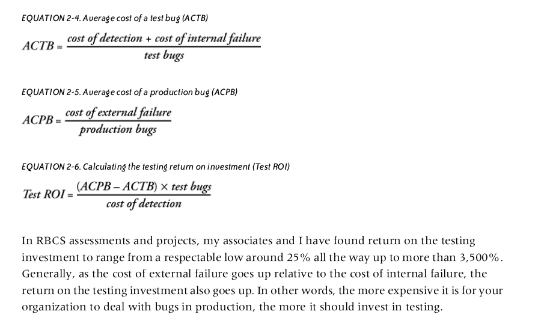
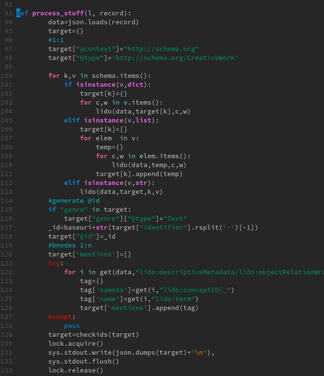
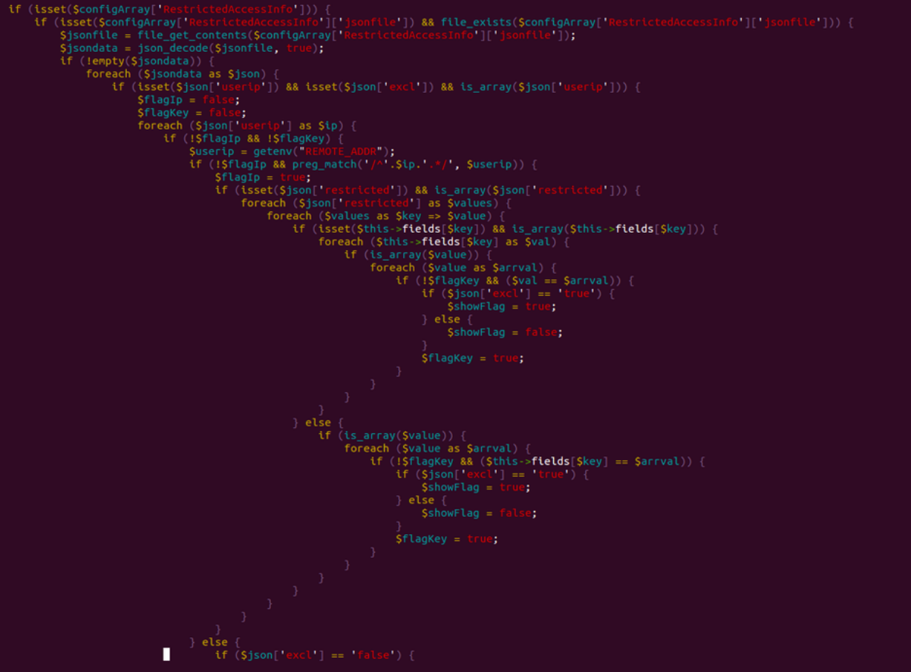
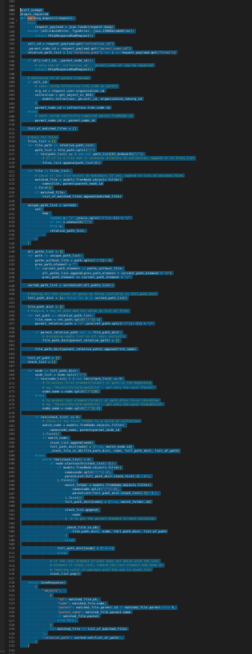
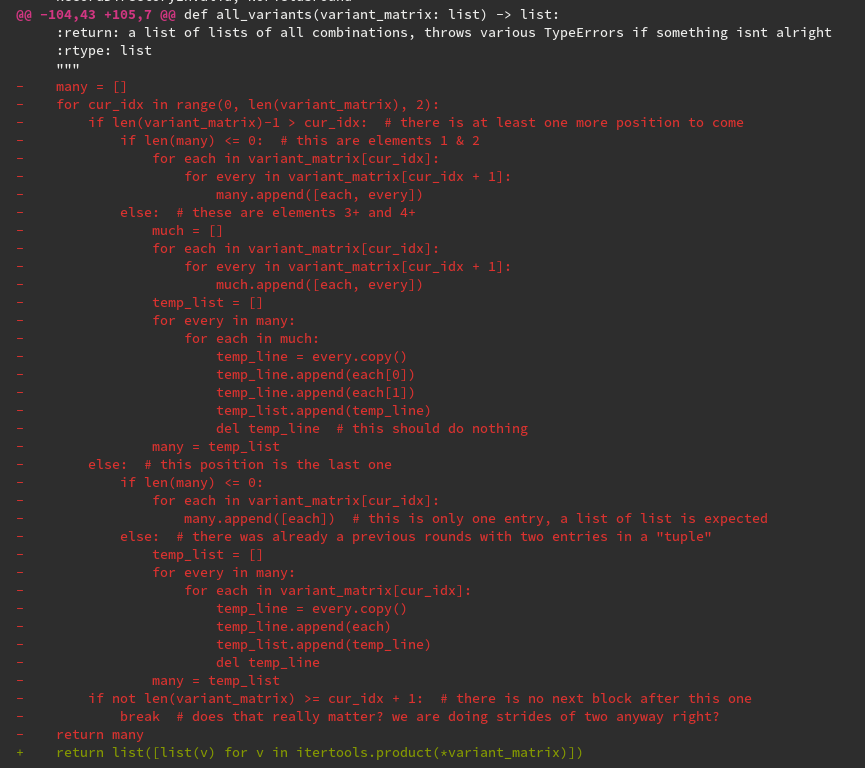
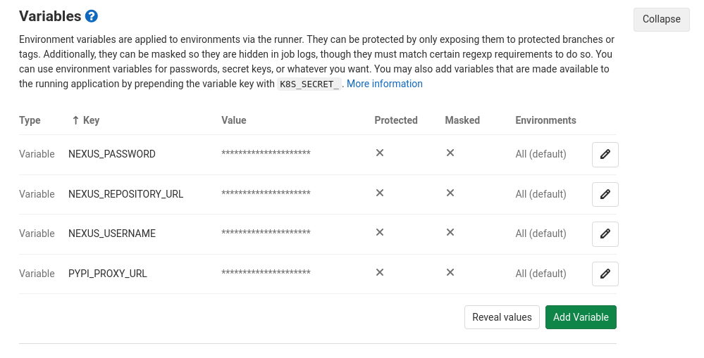

---
title: "Clean Code with Python"
author: [Martin Czygan]
date: "2022-09-07"
subject: "Python, Clean Code"
keywords: [Python, Clean Code]
subtitle: "A tour through techniques, projects and examples"
lang: "en"
titlepage: true,
titlepage-text-color: "FFFFFF"
titlepage-rule-color: "360049"
titlepage-rule-height: 0
titlepage-background: "background.pdf"
...


# Introduction

## What we need

* Examples use Python 3
* Editor with Python support
* You will get all material in a zip file shortly after the course

## Approach

We will use three components:

* documents (instead of slides), exploring topics
* code examples
* coding tasks
* questions (and answers) in a shared pad (etherpad)

We can (and should) detour into specific questions any time.

## Inspiration: Books on real software development, like "Clean Code" or the "Practice of Programming"

### Books

* [Clean Code](https://www.oreilly.com/library/view/clean-code-a/9780136083238/)
* [The Practice of Programming](https://www.cs.princeton.edu/~bwk/tpop.webpage/)
* [Clean Code in Python](https://www.packtpub.com/product/clean-code-in-python/9781788835831)
* [Refactoring](https://www.martinfowler.com/books/refactoring.html)
* ...

### Clean code is not a single thing

* while popularized by Robert C. Martin, it is not *one thing*
* more like: "small things matter", or *small things add up*

> [...] attentiveness to detail is an even more critical
foundation of professionalism than is any grand vision [CC]

> Writing clean code requires the disciplined use of a **myriad little
> techniques** applied
through a painstakingly acquired sense of "cleanliness." [CC]

Inspiration comes from a broad literature on software engineering and other fields:

* Patterns research community (design patterns)
* Research Labs (e.g. Bell Labs)

Architecture:

* Christopher Alexander, A pattern language (1977)

Japanese production lines: Total Productive Maintenance (TPM) using **5S** (1950-1970):

* Seiri - "sort", "know where things are"
* Seiton - "systematize", "tidyness", a place for everything and everything in its place
* Seiso - "shine", keep the work place free of handing wires, waste, ...
* Seiketsu - "standardization", consensus on how the workplace is kept clean
* Shutsuke - "self-discipline", follow rules over time

Fred Brooks (IBM):

* rewrite every seven years (to cleanup up)
* example: an popular maps web application is at least at its second complete
  rewrite

Many practicioners can be be quoted (from various fields):

> preoccupation with *detail* is common to all endeavors of excellence

Interestingly, a classic CS education does not necessarily go into these kind
of (coding) details.

### Programming as a loser's game

* hypothesis: software development is *loser's game* ([article](https://thehosk.medium.com/software-development-is-a-losers-game-fc68bb30d7eb))
* analogy from (amateur and expert) tennis (Charles Ellis, 1970's, investing context)

> “In expert tennis, about 80 per cent of the points are won; in amateur
> tennis, about 80 per cent of the points are lost. In other words,
> professional tennis is a Winner’s Game — the final outcome is determined by
> the activities of the winner — and amateur tennis is a Loser’s Game — the
> final outcome is determined by the activities of the loser. The two games
> are, in their fundamental characteristic, not at all the same. They are
> opposites.” Charles Ellis

* you win by avoiding mistakes (and not necessarily by being extraordinary)

### Dogma

* while there are rules and techniques, following a dogma blindly will probably not help
* teams with underspecified process can win, teams working *by the book* can fail
* there is a balance between business and software needs, that is a challenge to find and keep


# Overview

## What is clean code?

Before we dive in, what is our take?

* Please, go to the pad and answer briefly, or with keywords:

> Question: How would you describe clean code? Which properties would it have?

### What other people say

The Book let's a few people speak.

> I like my code to be elegant and efficient. The
logic should be straightforward to make it hard for bugs to hide, the
dependencies minimal to ease maintenance, error handling complete according to
an articulated strategy, and performance close to optimal so as not to tempt
people to make the code messy with unprincipled optimizations.

> **Clean code does one thing well.** -- Bjarne Stroustrup

> Clean code is simple and direct. Clean code
**reads like well-written prose**. Clean code never obscures the designer's intent
but rather is full of crisp abstractions and straightforward lines of control.
-- Grady Booch

This emphasis of readability relates to *Readability counts.* from the Zen of
Python.


> Clean code can be read, and **enhanced** by a
developer other than its original author. It has **unit and acceptance tests**.
It has **meaningful names**. It provides **one way** rather than many ways for
doing one thing. It has **minimal dependencies**, which are explicitly defined,
and provides a clear and minimal API. Code should be literate since depending
on the language, not all necessary information can be expressed clearly in code
alone. -- Dave Thomas

> I could list all of the qualities that I notice in
clean code, but there is one overarching quality that leads to all of them.
**Clean code always looks like it was written by someone who cares**. There is
nothing obvious that you can do to make it better. All of those things were
thought about by the code’s author, and if you try to imagine improvements,
you’re led back to where you are, sitting in appreciation of the code someone
left for you—code left by some- one who cares deeply about the craft. --
Michael Feathers

> You know you are working on clean code when each
routine you read turns out to be **pretty much what you expected**. You can call it
beautiful code when the code also makes it look like the language was made for
the problem. -- Ward Cunningham


### Software Engineering and Programming

Software engineering has been described as programming over time, subjected to
deadlines.

* Boy scout rule: Leave the campground cleaner than you found it

Imagine checking code in, that is a tiny bit cleaner, more streamlined, better
documented, with fewer bugs than at checkout time. Code would only get better.
# Motivation: Software that fits your problem

## Overengineering

> 20K LOC for something that may be command line tool

too much design for a problem

## Underengineering

* everything lives in function in a language that supports OO
* no functions at all (single file, top to bottom, 15K lines)

## Let us do the job before we get regulated

* software is [volatile](https://stackoverflow.blog/2020/02/20/requirements-volatility-is-the-core-problem-of-software-engineering/)
* first SW engineering conference took place in [1968](http://homepages.cs.ncl.ac.uk/brian.randell/NATO/NATOReports/)

# Software is still complex, software is a losers game

* you can win by just avoiding some bad practices

# Pragmatic Python

* Some patterns are not required, because Python is expressive
* Keep it pragmatic, use magic sparingly

# Clean Code critique

* stop recommending clean code: [article](https://qntm.org/clean)

# Disclaimer

## what do you prefer?

* clean code, no revenue, or
* spaghetti code making a million a month

## Writing software is a complex activity

> Writing software is a complex activity and we should respect that, when we
> talk about it, when we discuss all matters software# Clean Code Principles

## Classic software failures

* projects go over budget
* companies spend millions and end up nowhere
* bad software causes fatalities, impacts revenue, and can pose generic risks,
  e.g. security incidents

A 2015 article in IEEE spectrum:

* [Transistor Production Has Reached Astronomical Scales](https://spectrum.ieee.org/computing/hardware/transistor-production-has-reached-astronomical-scales)

Every second of 2014, on average 8 trillion transistors were produced. It is
some software that will run on these.

Robert C. Martin motivation: Let us cleanup ourselves before we are going to be
hit by regulation.

We are living in the age of data, so here's a quip on data and code:

> Code ages like fish, data ages like wine.

## Calculating failure costs

* ROI on testing
* How much time can you invest in testing - or improving code in general?



## Clean code layers (top down)

* Architecture
* Patterns
* Data Structures
* Idiomatic Code

### The right architecture and approach

* rarer, but important decisions
* try to postpone hard questions regarding design
* sometimes [Worse is better](https://en.wikipedia.org/wiki/Worse_is_better)

> Worse is better (also called the New Jersey style) is a term conceived by
> Richard P. Gabriel in an essay of the same name to describe the dynamics of
> software acceptance. It refers to the argument that software quality does not
> necessarily increase with functionality: that there is a point where less
> functionality ("worse") is a preferable option ("better") in terms of
> practicality and usability.

### Useful patterns

* code reuse (i.e. find a suitable library)
* tool reuse ("Taco Bell", [article](http://widgetsandshit.com/teddziuba/2010/10/taco-bell-programming.html))

> The more I write code and design systems, the more I understand that many
> times, you can achieve the desired functionality simply with clever
> reconfigurations of the basic Unix tool set. After all, functionality is an
> asset, but code is a liability. [...] Every time you write code or introduce
> third-party services, you are introducing the possibility of failure into
> your system.

* convention over configuration

### The right data structures

* worry about data structures
* rather 1 data structure and 100 methods than 10 with 10 each

### Idiomatic code (readability)

* make code look boring
* make wrong code look wrong
* Perl ("there is more than one way to do it") to Python ("There should be one–
  and preferably only one –obvious way to do it")
* use the language (to your advantage)

### Cross-cutting concern

Worry about things that are not directly code, like deployment, continuous test
and build processes, etc.

* software lifecycle and support
* CI
* testing
* docs (developer, external, ...)
* setup

## Learn from open source projects

* pragmatic
* efficient
* documented

There is plenty wrong with OSS as well, but successful project can be an inspiration.

* Companies switch (or switched) to basically a common open source workflow
  when they adopted hosted git server applications

## SW engineering's greatest hits

* [Software Engineering's Greatest Hits](https://www.youtube.com/watch?v=HrVtA-ue-x0), [Slides](https://third-bit.com/talks/greatest-hits/#1)

What does research says about software development practices?

* novice errors
* TDD studies
* code metrics

> But nothing works better than counting lines of code

* error handling

> Majority of catastrophic failures could easily have been prevented by
> performing simple testing on error handling code

* exceptions

> Most common catch block logs the error rather than trying to recover from it

And the list goes on.

## Good code properties

There are generic ideas and approaches that have been suggested to improve code
quality.

* Question (Pad):

> Name one you would attribute to describe good code and one to less good code

### Design by contract

* Betrand Meyer, 1980s
* Programming language: Eiffel
* deferred PEP-361 (2003): https://peps.python.org/pep-0316/
* https://github.com/Parquery/icontract

Example: [Snippets/Contracts]

Without specific contract library:

* makeing properties explicit with assertions or explicit checks (and e.g.
  raising `ValueError` on failures)

### Defensive programming

Design to [...] ensure the continuing function of a piece of software under unforeseen circumstances.

This can mean:

* focus on absence of errors
* readable, auditable code
* extra care when dealing with I/O

#### Error handling

* catch specific errors (avoid empty except)
* handle some gracefully
* fail fast

Find the *right level* for your exception.

* reuse existing exception hierarchy: [https://docs.python.org/3/library/exceptions.html](https://docs.python.org/3/library/exceptions.html)

You can include original exceptions via [PEP-3134](https://peps.python.org/pep-3134/) - "Exception Chaining and Embedded Tracebacks"

> Example: [Snippets/ExceptionChaining]

> [...] implicit exception context can be supplemented with an explicit cause by using from with `raise`.

#### Use sensible default values

* across various layers
    * command line flags
    * keyword arguments

Use language facilities, like:

```
dict.get(key, default)
```

### Assertions

* `assert`
* assertions as a last resort (e.g. halt program instead of handling an error)

Can be disable at runtime, e.g. with `python -O script.py`

```python
$ python -c "assert False"
Traceback (most recent call last):
  File "<string>", line 1, in <module>
AssertionError
```

With basic optimizations:

```
$ python -Oc "assert False"
```

### Encapsulation

* module interfaces should be simpler than the implementation

In [Philosophy of Software
Design](https://web.stanford.edu/~ouster/cgi-bin/book.php) Ousterhout reports
various issues in implementations:

* students wrote too many classes for the problem - information leakage between
  classes; e.g. two classes to handle HTTP requests - hence both classes
implemented many aspects of understanding the request data structure

> slightly larger classes could have helped to hide information (details about
> the request) better

### Separation of concerns

#### Avoid adding to many responsibilities

Case study: A DSL coupled with a backend storage system (SM).

### Cohesion and coupling

* cohesion: well defined purpose; coupling: dependency between code
* aim for: high cohesion and low coupling ("oss" - separate parts, ...)

### DRY

* don't repeat yourself
* there is also the *rule of three* - use opportunities to abstract or factor out a piece of code

### YAGNI

* related to TDD a bit
* what you need vs what you want
* some instances: abstracting backends (albeit only one is and will be used)
* any *potential* benefit

> It can be hard to distinguish between design and YAGNI

### KISS

* from aerospace industry

> “Our aim,” he said, “is to get results cheaper, sooner, and better through
> application of common sense to tough problems. If it works, don’t fix it.”
> “Keep it simple, stupid—KISS—is our constant reminder.” -- [Biographical Memoir](http://www.nasonline.org/publications/biographical-memoirs/memoir-pdfs/johnson-clarence.pdf#page=13)

#### Smallest data structure to fit the problem

Quick question:

You are tasked to implement depth-first search on a graph. How could you
implement a graph?

### EAFP and LBYL

Python prefers the style: easier to ask for forgiveness than permission, or EAFP for short.

Example:

```python
data = {
    "a": 1,
    "b": 2,
}

# Works, LBYL style (https://docs.python.org/3/glossary.html#term-lbyl)
if data.has_key("a"):
    v = data["a"]
else:
    do_something_else()

# Better, following EAFP (https://docs.python.org/3/glossary.html#term-eafp)
try:
    v = data["a"]
except KeyError:
    do_something_else()
```


### Composition and inheritance

Example for sensible inheritance:

* socketserver and http packages: [socketserver.py](https://github.com/python/cpython/blob/ecfff63e06e77e22035a7f7caa26986f033f3aea/Lib/socketserver.py#L672-L709), [server.py](https://github.com/python/cpython/blob/main/Lib/http/server.py)

```python

"""
...
There are five classes in an inheritance diagram, four of which represent
synchronous servers of four types:
        +------------+
        | BaseServer |
        +------------+
              |
              v
        +-----------+        +------------------+
        | TCPServer |------->| UnixStreamServer |
        +-----------+        +------------------+
              |
              v
        +-----------+        +--------------------+
        | UDPServer |------->| UnixDatagramServer |
        +-----------+        +--------------------+
...
"""

class HTTPServer(socketserver.TCPServer):

    allow_reuse_address = 1    # Seems to make sense in testing environment

    def server_bind(self):
        """Override server_bind to store the server name."""
        socketserver.TCPServer.server_bind(self)
        host, port = self.server_address[:2]
        self.server_name = socket.getfqdn(host)
        self.server_port = port


class ThreadingHTTPServer(socketserver.ThreadingMixIn, HTTPServer):
    daemon_threads = True
```

A mixin here adds threading functionality (but not more).

#### Inheritance related anti-patterns

* Anemic Domain Model
  * data and related behaviour in two separate classes
* BaseBean (no beans in Python, though)
  * you may inherit from a dictionary to get lookup functionality (rather, use a dictionary)
* Circle-Ellipsis problem (or Square-Rectangle Problem) - violated LSP ([...] It
  is only when derived types are completely substitutable for their base types
  [...])

#### Multiple inheritance and MRO

Python allows multiple inheritance.

* methods are resolved using C3 algorithm

Can make it easy to combine functionality:

```python
class LoggingDict(dict):
    def __setitem__(self, key, value):
        logging.info('Setting %r to %r' % (key, value))
        super().__setitem__(key, value)

class LoggingOrderedDict(LoggingDict, collections.OrderedDict):
    pass
```

#### Mixins

* Mixins do provide partial functionality
* Example: ThreadingMixIn

### Functions and arguments

* anything that can be derived should not be passed separately (request)
* use the already aggregated object

```python

def f(request.header, request.body):
  pass

def f(request):
  header = request.header
  body = request.body
```

* or use some convential form

Example:

* instead of `f(filename, fh): pass` you can decide, whether you need the
  filename and file handle as separate parameters

#### Too many arguments lead to higher coupling

* in general, too many arguments lead to higher coupling
* in python, keyword (default) arguments are your friend (example: [pandas.read_csv](https://pandas.pydata.org/docs/reference/api/pandas.read_csv.html))


#### Group parameters

* similar to the request example
* for example config or "option" objects

## Package design

* setup.py

## Packaging options

* linkedin example: shiv

### Automation with gitlab

```yaml
# git push sc master => runs CI
#
# git tag v0.1.2
# git push sc --tags => creates package and uploads to Nexus

image: python:3.9.6-slim-buster

stages:
  - test
  - deploy

before_script:
   - pip install --upgrade pip
   - pip install pytest twine

tests:
  stage: test
  script:
    - pip install backports.csv # try installing this from pypi, nexus may not like the [.]
    - python setup.py develop --index-url $PYPI_PROXY_URL # faster, less load for pypi
    - pytest
  tags: [docker]
  except:
    - tags

upload_to_nexus:
  stage: deploy
  variables:
    TWINE_USERNAME: $NEXUS_USERNAME
    TWINE_PASSWORD: $NEXUS_PASSWORD
  script:
    - python setup.py sdist
    - twine upload --repository-url $NEXUS_REPOSITORY_URL dist/*
  only:
    - tags
  tags: [docker]
```

## Task: Find ways to improve code

This is a basic Tic-Tac-Toe implementation, but it can be improved:

```python

"""
Task: Find potential improvements in the following code. Name them and suggest an alternative.

Code implements a basic TicTacToe game.
"""

import random


def check(game):
    if '.' not in game:
        return True
    if game[0] == game[1] and game[1] == game[2] and game[0] != '.':
        return True
    if game[3] == game[4] and game[4] == game[5] and game[3] != '.':
        return True
    if game[6] == game[7] and game[7] == game[8] and game[6] != '.':
        return True
    if game[0] == game[3] and game[3] == game[6] and game[0] != '.':
        return True
    if game[1] == game[4] and game[4] == game[7] and game[1] != '.':
        return True
    if game[2] == game[5] and game[5] == game[8] and game[2] != '.':
        return True
    if game[0] == game[4] and game[4] == game[8] and game[0] != '.':
        return True
    if game[2] == game[4] and game[4] == game[6] and game[2] != '.':
        return True
    return False


def print_board(board):
    print()
    print(board[0] + board[1] + board[2])
    print(board[3] + board[4] + board[5])
    print(board[6] + board[7] + board[8])


def tic_tac_toe(board, player):
    while True:
        if not check(board):
            if player == 'x':
                pos = int(
                    input("[{}] your move [0-8]? ".format(player))
                )
            else:
                pos = random.randint(0, 8)
            if board[pos] == '.':
                board[pos] = player
                if player == "x":
                    player = "o"
                else:
                    player = "x"
                print_board(board)
        else:
            return


if __name__ == "__main__":
    board = ['.' for _ in range(9)]
    tic_tac_toe(board, "x")

```# Clean Code Continued

## Coding Guidelines

* I remember a time, when coding styles were something special. There was
  Checkstyle for Java (first released in 2001).
* Around the same time PEP8 was created (on 05-Jul-2001).

> PEP stands for Python Enhancement Proposal; The first PEP, PEP1, describes the process.

> A PEP is a design document providing information to the Python community, or
> describing a new feature for Python or its processes or environment.

Over 500 PEP has been suggested since then (PEPs are numbered, although with gaps).

Other notable PEPs are:

* [PEP 20 -- The Zen of Python](https://www.python.org/dev/peps/pep-0020/)
* [PEP 257 -- Docstring conventions](https://www.python.org/dev/peps/pep-0257/)
* [PEP 3000 -- Python 3000](https://www.python.org/dev/peps/pep-3000/)


### PEP 8 -- Style Guide for Python Code

> One of Guido's key insights is that code is read much more often than it is
> written. The guidelines provided here are intended to improve the readability
> of code and make it consistent across the wide spectrum of Python code.

Every rule has exceptions.

> However, **know when to be inconsistent** -- sometimes style guide
> recommendations just aren't applicable. **When in doubt, use your best
> judgment**. Look at other examples and decide what looks best. And don't
> hesitate to ask!

### PEP8 condensed

#### Layout

* use 4 spaces (tabs, however, increase accessible e.g. for visually impaired programmers)
* indent consistently (Python 3 disallows mixing the use of tabs and spaces for indentation)

You can go further by using a tool like
[editorconfig](https://editorconfig.org/) to communicate a standard.

* continuation alignment ([examples](https://www.python.org/dev/peps/pep-0008/#indentation))
* maximum of 79 chars per line, and use continuation to break up lines or backslashes (note: I've seen this rule ignored often)
* lines should break before a binary operator ([example](https://www.python.org/dev/peps/pep-0008/#should-a-line-break-before-or-after-a-binary-operator))
* blank lines: 2 around classes and top level functions; one around methods; sparingly inside functions
* code should be written in UTF-8
* imports should be on separate lines
  ([example](https://www.python.org/dev/peps/pep-0008/#imports)), and always on
top of the file; in the best case they follow an order (stdlib, 3rd-party,
local).

> There is a tool called [isort](https://github.com/PyCQA/isort) that allows
> you to sort imports.

```python
$ cat unsorted.py
import re
import csv
import pandas as pd

```

Check the ordering.

```shell
 isort -c unsorted.py
ERROR: ... Snippets/SortImports/unsorted.py
    Imports are incorrectly sorted and/or formatted.
```

Dry run with `-d` flag:

```shell
$ isort -d unsorted.py
import csv
import re

import pandas as pd
```

* prefer absolute imports and simple package layouts
* put "module level dunder" names after docstring, before imports (except future special import)

#### String Quotes

* both single and double quotes are allowed, use consistently

#### Whitespace

* various considerations around whitespace; [examples](https://www.python.org/dev/peps/pep-0008/#whitespace-in-expressions-and-statements)

#### Trailing commas

```python
FILES = ('setup.cfg',)
```

It would be syntactically correct to remote the parentheses, but they are left
for clarity.

In lists, the last value can (and should) have a comma, too:

```python
FILES = [
    'setup.cfg',
    'tox.ini',
    ]
```

#### Comments

> Comments that contradict the code are worse than no comments. Always make a
> priority of keeping the comments up-to-date when the code changes!

That is both an important and hard rule to follow. You have to think about
documentation as something equally important as code. It helps to **re-read** code
and fix issue incrementally.

----

Sidenote: Motivation and Documentation

Armin Ronacher, a long time active member of the Python community remarked that
documentation should look good. So good, that you want to write more of it, or
make it even clearer. There are a couple of documentation framework that can
help with that.

----

> Comments should be complete sentences. The first word should be capitalized,
> unless it is an identifier that begins with a lower case letter.

----

Sidenote: Comments and documentation can be a topic of discussion.

More than once I heard:

> Nobody will use my code, I do not need comments.

True, and often realistic. But is it enough to skip it altogether? Maybe you
are working on different project and after two years you come back to old,
undocumented code - your code can get foreign (even to yourself) soon.

I think there are reasons to skip e.g. documentation entirely, you want a
throwaway prototype or something similar.

----

* no inline comments, unless specific

```python
x = x + 1                 # Increment x
```

Comments can distract, but might add context.

```
x = x + 1                 # Compensate for border
```

### Other

PEP8 talks about names, and as they are important, let's move them to a
separate section.

## Naming Conventions

Let's first pin down a few general prinicples.

We name variables, functions, classes, modules, packages. Good names ease
understanding, less good names obstruct, or even mislead. Remember that code is
read 90% of the time, so considering sensible names is important.

### Reveal your intent

The following code snippet does not reveal its intent.

```python
def get_it():
    list1 = []
    for x in the_list:
        if x % 4 == 0:
            list1.append(x)
    return list1
```

* *implicity* of code
* the zen of python states (line 2): explicit is better then implicit

Trying to be explicit is an act of communication.

### Distinct names

* you will find fewer of these names in Python, but
  `XYZControllerForEfficientHandlingOfStrings`,
`XYZControllerForEfficientStorageOfStrings` are not distinct enough

### Meaningful distinctions

It happens that you have more of one thing and you end up with variable names
like: `a1`, `a2` and so on.

Typically, there is a better way to write this by grouping similar items in a
container like list or dictionary.

```python
transforms = [a, b, c]
```

What has been `a1` will become `a[0]` and so on.


----

Sidenote: Intents

* read own code and other peoples code
* good variable names make comments obsolete
* use constructs with intent

As an example for intent, sometimes you can choose between a list and tuple. A
tuple signals immutability to a reader, while functionally using a list or tuple
might be equivalent.

You can use a list and check, if an element is already in there. But Python has
a built-in `set` data type that conveys this exact meaning.

A program can have an exit code (e.g. important when used in scripts). It is a
fine detail, but these exit codes can convey meaning (some programs, e.g. like
wget use a range of exit codes that you can quickly lookup, which is helpful for
debugging).

Example: [Snippets/Unique](Snippets/Unique)

----

### Avoid noise

Other languages (e.g. Go) are being explicit about this, although Python has a
more flexible import system.

```python
class Product:

    def __init__(self):
        self.product_info = {}
        self.product_data = {}

product = Product()
product.product_info # XXX: too noisy
...
```

Noise slows us down. Imaging you encounter two classes, e.g.:

* Customer
* CustomerObject

Which one do you choose? Every decision we open up to the reader to figure out
him or herself can be a potential time sink as the reader needs to establish
the context first, by reading code, reading documentation, asking a colleague
and so on. Something that should have taken a minute, takes hours or days.

### Use pronouncable names

* `modymdhms` is hard to spell out and (without autocomplete) easy to get wrong

### Use searchable names

Code is read more often that it is written and finding relevant code is important.

* Rule: The length of a name should correspond to the size of its scope

When using the command line, `grep -r` and `ack` are your friends.

### Avoid mental mapping

We see this over and over again: clean code relates to reducing the *cognitive load*.

----

> But programmers are smart and juggle many things in their head at any point in time, no?

> Yes, they are and do. But clarity is king.

----

* a name that does not need a (semantic) translation reduces cognitive load

### Don't be cute

* since you can use any name, why not spice up names

```python
def make_me_a_sandwich(user):
    """ Grants user admin privileges. """
    ...
```

* do not do it, keep it boring, `set_admin_privileges(user)`.

### Use one word per concept

* fetch, retrieve, get - what is the difference?
* you are again making the reader think (which you want, but also do not want)
* if I see method names using fetch, retrieve and get used for similar things,
  I will start to try to understand what exactly this difference is made of -
which takes away time

Other examples:

* controller, manager, driver
* transform, process, modify, ...


### Use solution domain names

There will usually be a specific technical term, that has

```python
def enqueue_task(task):
    ...

def handle_websockets(conn):
    ...

def dfs(node):
    ...
```

### Use problem domain names

When no technical term fits the bill, names from the problem domain should be used.

```
def edge_detect(img):
    ...
```

## Naming Conventions according to PEP8

In the context of PEP8.

* aspirational, should be considered, but ok to miss, when code exists that
  follows a different style

### Regarding noise

> The X11 library uses a leading X for all its public functions. In Python,
> this style is generally deemed unnecessary because attribute and method names
> are prefixed with an object, and function names are prefixed with a module
> name.

```python
import os

if os.path.exists("filename"):
    pass
```

An exception is `os.stat` which returns (the C equivalent of a) namedtuple
(PyStructSequence); here all fields are prefixed by `st_`, e.g. `st_mode`,
`st_size` (see: [https://git.io/JUbO5](https://git.io/JUbO5)).

### Names to avoid

Single character variables names:

* `l`, `O`, `I`

### Module names should be short

Excluding some files, there are about 800 python files in the Python distribution.

<!-- find . -name "*py" | grep -v "lib2to3" | grep -v "test_" | grep -v "/test"
| grep -v "__init__.py" | wc -l -->

* around 20% of the module names have an underscore in it (see sample)

```shell
mac_greek.py
text_file.py
import_diagnostics.py
mac_croatian.py
build_scripts.py
popen_fork.py
iso8859_14.py
find_max_nesting.py
iso8859_2.py
asdl_highlight.py
```

### Class Names

* should use the `CapWords` convention

### Exceptions

* should be written with `CapWords` as classed, but have `Error` appended
* Example: `ClassificationError`

### Global variable names

* try to avoid them; the can make reasoning about functions that use them much harder

If you use them on a module level, use the `__all__` mechanism to explicitly
name exported names.

### Function and variable names

> Function names should be lowercase, with words separated by underscores as
> necessary to improve readability.

> Variable names follow the same convention as function names.

> mixedCase is allowed only in contexts where that's already the prevailing
> style (e.g. threading.py), to retain backwards compatibility.

### Function and method arguments

> Always use **self** for the first argument to instance methods.

> Always use **cls** for the first argument to class methods.


### Instance variables

* use a leading underscore only to for non-public methods and instance variables
* there are not visibility modifiers in Python, so access will still be possible

### Constants

* typically `ALL_UPPERCASE`

### Design for inheritance

Some ideas to keep in mind in context of object oriented programming.

* start with non-public methods, if unsure; as a public API might mean commitment
* or otherwise make clear that an API is not fixed yet

Attribute access.

> For simple public data attributes, it is best to expose just the attribute
> name, without complicated accessor/mutator methods.

* keep functional aspect (e.g. via properties) side-effect free
* no computationally expensive operation in a property (the attribute access
  signals a relatively fast operation)

Try to design classes to be subclasses in a way, that reduces the need to hide
data to a minimum. There is a name-mangling rule in Python.

```python
class A:
    def __init__(self):
        self.name = "any"
        self.lang = "python"

class M:
    def __init__(self):
        self.__name = "any"
        self.__lang = "python"

class B(A):
    def hello(self):
        print(self.name)

class C(M):
    def hello(self):
        print(self.__name)

b = B()
c = C()

b.hello()
# c.hello() # AttributeError
```

### Private and public interfaces

> To better support introspection, modules should explicitly declare the names
> in their public API using the `__all__` attribute. Setting `__all__` to an
> empty list indicates that the module has no public API.

## Clean Code rules and principles

Care in small things will add up. Ergonomically, it might be easier to focus on
a little improvement at a time.

Some guiding principles:

* write small functions
* use descriptive names
* use boolean flags as little as possible
* minimize side effects
* do one thing
* do not repeat yourself

----

Sidenote: A Python snippet from the web



* [Snippets/Lido](Snippets/Lido)

Again, use the etherpad.

> Question: Name a few issue with this code.

You can read the code here as well:

* https://gist.github.com/miku/dce655ebbfb7218760af4c8c60f47629#file-example-py-L93-L133
* https://git.io/JUNMr

----

## SOLID Principles

Principles for design. Managing dependencies (between components) - how change
propagates to a system. There can be similar concerns expressed for data (e.g.
dependencies of data artifacts).

### Single Responsibility Principle (SRP)

* SRP: a class should have one and only one reason to change - reported in
  Philosophy of Software Design as a typical error (e.g. HTTP request library)

### Open/closed principle (OCP)

* you should be able to extend a class's behaviour without modifying; a
  compositional pattern

Typically done by subclassing a base class.

* we extend the behaviour
* we reuse methods of the superclass
* the superclass is completely unaware of its subclasses

If the superclass changes its behaviour, it will affect the subclasses.

* another way is to extract interfaces and supply different implementations
* an interface is declarative, does not supply implementation and hence subclasses will not be coupled to a specific superclass implementation detail

In Python, explicit interfaces are rarely seen.

* You can define a class to be subclassed and provide no implementation.

Example: [Snippets/AbstractClass](Snippets/AbstractClass)

The standard library supports the implementation of a number of standard
interfaces in the
[collections.abc](https://docs.python.org/3/library/collections.abc.html)
module.

### Liskov substitution principle (LSP)

* Objects of a superclass shall be replaceable with objects of its subclasses
  without breaking the application.

Example of a not following this rule: [Liskov](Snippets/Liskov)

### Interface Segregation Principle (ISG)

* No client should be forced to depend on method it does not use ()
* keep interfaces small

In Python, we have duck-typing. You can pass any object to a function, as long
as it "responds" to a method, it satisfies an *informal* interface.

* Example: [Reader](Snippets/Reader)

### Dependency Inversion Principle (DIP)

* High-level modules should not depend on low-level modules. Both should depend on abstractions (e.g. interfaces).
* Abstractions should not depend on details. Details (concrete implementations) should depend on abstractions.

A typical design approach is bottom-up: Write lower level components first, then
build abstractions on top of them, directly. This can lead to coupling, as a lower level module might not easily changed.

By introducing an abstraction, a user and provider of functionality can be
decoupled.

* Example: [DependencyInversion](Snippets/DependencyInversion)

Note: Dependency Injection is a debated topic in Python. [Why is IoC / DI not
common in
Python?](https://stackoverflow.com/questions/2461702/why-is-ioc-di-not-common-in-python).

Quoting James Shore:

> "Dependency Injection" is a 25-dollar term for a 5-cent concept. [...]
> Dependency injection means giving an object its instance variables.

## Generic rules

* KISS (keep it simple, solid), aka "flintstoning"
* DRY (don't repeat yourself)
* YAGNI (you ain't gonna need it)
* Composition over inheritance (example: logging module in standard library)
* Readability counts (Line seven of Zen of Python)
* The rule of three
* Principle of least surprise


A small, but effective tweak.



The rule spelled out:

> Let the happy path flow down the left hand edge.

If necessary invert conditions to keep reduce indent.

```python
if json_obj is not None:
    authors = json_obj.get("author")
    if authors is not None:
        for author in authors:
            orcid = self.om.normalise(author.get("ORCID"))
            if orcid is not None:
                result.add(orcid)

```

----

Task: Apply the "happy path" rule to the snippet above.

* [https://github.com/opencitations/index/commit/09af4a174c0a6dbcf4a838550b5ad558fc3dcee6](https://github.com/opencitations/index/commit/09af4a174c0a6dbcf4a838550b5ad558fc3dcee6)


## Patterns and anti-patterns in Python

Patterns and anti-patterns.

### Avoid global

A global variable can potentially be altered from many places and can complicate
code comprehension.

* avoid the `global` keyword

----

Sidenote: On a higher level, the essay/paper "Out of the tar pit" (2006) talks
about common problems in software construction.

One key observation is that state, and keeping track of state.

> The biggest problem in the development and maintenance of large-scale software
> systems is complexity — large systems are hard to understand. We believe that
> the major contributor to this complexity in many systems is the handling
> of state and the burden that this adds when trying to analyse and reason about
> the system.


----

### Avoid mutable default values

A source of bugs is the following snippet:

```python
def fun(a=1, b=[]):
    b.append("x")
    print(b)


fun()
fun()
```


The alternative is to use `None` as a default:

```python
def fun(a=1, b=None):
    if b is None:
        b = []
    b.append("x")
    print(b)
```

### EAFP

Python prefers the style: easier to ask for forgiveness than permission, or EAFP for short.

Example:

```python
data = {
    "a": 1,
    "b": 2,
}

# Works, LBYL style (https://docs.python.org/3/glossary.html#term-lbyl)
if data.has_key("a"):
    v = data["a"]
else:
    do_something_else()

# Better, following EAFP (https://docs.python.org/3/glossary.html#term-eafp)
try:
    v = data["a"]
except KeyError:
    do_something_else()
```

### Classes vs functions

* OOD and OOP emphasize classes (and some languages require them)
* Python is a "multi-paradigm" langauge
* Talk by Jack Dietrich: "Stop writing classes" (reducing hundreds of lines to a few dozens)


## Test automation and test-driven development

* a school of programming favors a test first approach (or TDD)
* the basic idea: write a failing test first, then write code to make it pass (and only to make it pass)

Example: [Snippets/TestDriven](Snippets/TestDriven)

## Refactoring tools

* typically supported by IDEs, such as PyCharm
* rename, invert boolean, ...

## Code metrics

* tokei; sloccount
* pylint

## Detecting fragile code

* cyclomatic complexity

## Balanced Toolset

More tools:

* pyflakes
* mypy and type hints - Example: [Snippets/Mypy](Snippets/Mypy)

```
$ mypy Snippets/Mypy/hints.py
Success: no issues found in 1 source file
```

* pycodestyle (formerly pep8)

Example output:

```python
$ pycodestyle --first siskin
siskin/__init__.py:43:80: E501 line too long (80 > 79 characters)
siskin/conversions.py:136:24: E741 ambiguous variable name 'l'
siskin/mab.py:168:12: E713 test for membership should be 'not in'
siskin/mappings.py:82:1: E265 block comment should start with '# '
siskin/test_arguments.py:52:27: E711 comparison to None should be 'if cond is None:'
siskin/test_utils.py:140:26: E712 comparison to True should be 'if cond is True:' or 'if cond:'
siskin/utils.py:96:9: E731 do not assign a lambda expression, use a def
siskin/utils.py:566:29: W605 invalid escape sequence '\d'
siskin/assets/161/161_marcbinary.py:27:5: E722 do not use bare 'except'
siskin/assets/101/101_marcbinary.py:60:15: W291 trailing whitespace
siskin/assets/183/183_marcxml_sru.py:100:72: E262 inline comment should start with '# '
```

Enforcing code styles.

* black
* yapf

The latter can be configured.

```
$ cat .style.yapf
[style]

based_on_style = pep8
split_before_logical_operator = true
column_limit = 160
```

## Elements of agile programming

Agile programming tries to take on a different perspective on software
development, shifting emphasis.

* Individuals and interactions over processes and tools
* Working software over comprehensive documentation
* Customer collaboration over contract negotiation
* Responding to change over following a plan

Value feedback and everything that allows you to collect feedback more easily.

----

Sidenote: A way to get to feedback.

Working on a plugin project for a application, that was slowly loading. Every
invocation (e.g. manual test) required to wait about ten seconds and would
involve a couple more manual steps. Doable, but annoying.

Solution: Factor out the bare minimum to execute the code (e.g. the plugin
loader) plus add some preloading.

Result: feedback time went from a minute to two seconds, development speed and
motivation did not decline.

----

## Learning from successful open source projects

* reading popular source repositories
* reading the standard library

Open source has various pragmatic aspects:

* time constrained development
* a wide range of contributions (developers of various levels, code,
  documentation, bug reports, pull requests, ...)

## Deconstructing complex code

* no single approach
* start or extend documentation
* extract (common) functions
* extract shared code into an independent library
* if they do not exist, write tests for functions
* try to find existing libraries that implement functionality

----

What do you think?

> Question: Which approach or technique of clean code do you find easily
applicable? Which one not?

# A few tips for Software Design

Inspired by:

* [Twelve quick tips for software design. PLoS Comput Biol 18(2): e1009809. https://doi.org/10.1371/journal.pcbi.1009809](https://journals.plos.org/ploscompbiol/article?id=10.1371/journal.pcbi.1009809)


## Design after the fact

> Many designers explain the design of their software by recapitulating its
history [7,8]. This is sometimes called challenge and response: The only way to
understand why some- thing works the way it does is to understand the problems
that existed at the time it was written and the tools that were available then.

Relates to comments in code that describe the circumstance (and not what is written).

* approach: write first, design, refactor

## Design for people's cognitive capacity

* humans have a short term memory limit
* How many details do I need to keep in my head as I am reading a particular
  piece of code?

## Design in coherent levels

* functions should be short, shallow and single purpose
* something that only takes up one slot in short term memory

You can ask: Between how many levels of detail do I need to jump while reading this code?

```python
def main():
    config = buildConfiguration(sys.argv)
    state = initializeState(config)
    while config.currentTime < config.haltTime:
        updateState(config, state)
    report(config, state)
```

The `while` condition could be taken "a level up", e.g. like:

```python
...
while stillEvolving(config, state):
   updateState(config, state)
   ...
```


## Design for Evolution

> More realistically, a change in one place should only require a small number
of changes in a few predictable places.

For example `stillEvolving` could be changed internally (to adapt), while client
code stays the same.

Two main ways:

* information hiding (interface, api and implementation)
* loose coupling (e.g. *command line*)

## Group related information together

What is easier to read?

```python
def enclose (x0, y0, z0, x1, y1, z1, nearness):
    ...
```

Or:

```python
def enclose (p0, p1, nearness):
    ...
```

## Design for delivery

* take care of the build process
* maybe a common way to build the project (e.g. Makefiles)
## The pytest project

* python has [unittest](https://docs.python.org/3/library/unittest.html) is
  standard library, classic framework (inspired by JUnit)
* setUp, tearDown, assertTrue, assertEquals, assertRaises, ...

The basic notions are similar:

* fixture
* test case
* test suite
* test runner

* one goal of pytest was to be a bit more pythonic (with unittest coming fro
JUnit)
* helpful messages

### Basics

* pytest detects tests by name prefix, e.g. `test_*` functions and methods
* grouping in a class possible
* only a single `assert`

Calling pytest with filename, directory or via name filter `-k` to select
specific files.

```
$ pytest test_fixture.py
$ pytest -k fix
```

### Marks

* setting metadata on functions
* a list of builtin marks can be found here: [marks](https://docs.pytest.org/en/stable/reference.html#marks-ref)

For example, you can mark a test function with
[skipif](https://docs.pytest.org/en/stable/reference.html#pytest-mark-skipif) to
skip under certain conditions; or
[xfail](https://docs.pytest.org/en/stable/reference.html#pytest-mark-xfail) to
expect a failed test.

### Fixtures

* pytest approach to fixtures is interesting, as it is mostly name based

If we run this, we do not get any output.

```python
def test_hello(tmpdir):
    print(tmpdir)
```

The test would pass, but not print anything on this successful test.

```
platform linux -- Python 3.7.8, pytest-6.1.1, py-1.9.0, pluggy-0.13.1
rootdir: /home/tir/code/miku/cleancodepython/Snippets/TestingBasic
collected 1 item

test_fixture.py .                                                            [100%]
```

We need to pass `-s` shortcut to see the output, as pytest offers various capture method.

```
  --capture=method      per-test capturing method: one of fd|sys|no|tee-sys.
  -s                    shortcut for --capture=no.
```

Default:

> During test execution any output sent to stdout and stderr is captured. If a
> test or a setup method fails its according captured output will usually be
> shown along with the failure traceback.

The output can be captured on a filesystem (fd 0 and 1) level (e.g. when calling
external commands) or on `sys.write` level. The `tee-sys` captures and passes
through output, like the tee (T) command.

* Example: [Snippets/Testing](Snippets/Testing), `test_ls.py`

There are more builtin fixtures:

* [https://docs.pytest.org/en/stable/builtin.html](https://docs.pytest.org/en/stable/builtin.html)

Examples are: caching values, capturing logging messages, recording warnings

### Fixture: monkeypatch

> monkeypatch can be used to patch functions dependent on the user to always
> return a specific value.

* Example: [Snippets/Testing](Snippets/Testing), `test_ssh.py`

### Custom fixture

Fixtures can provide various test dependencies. They are a form of dependency
injection.

You can include these in your testfiles or in `conftest.py` to be shared by multiple tests.

A fixture can be valid in different scopes:

> Fixtures requiring network access depend on connectivity and are usually
> time-expensive to create. Extending the previous example, we can add a
> scope="module" parameter to the @pytest.fixture invocation to cause the
> decorated smtp_connection fixture function to only be invoked once per test
> module (the default is to invoke once per test function).

> Possible values for scope are: function, class, module, package or session.

Initialization goes from session to function.

A fixture can handle both setup and teardown, when using `yield` at the point
where execution should continue in the test.

Examples:

* `test_fixture_custom.py`
* `test_fixture_autouse.py`
* `test_fixture_yield.py`

### Other plugins

* common data directory for test files:
  [pytest-datadir](https://pypi.org/project/pytest-datadir/) or
  [pytest-datafiles](https://pypi.org/project/pytest-datafiles/)


## Table Driven Tests

Not a new idea, but popularized a bit more by Go:

* [https://github.com/golang/go/wiki/TableDrivenTests](https://github.com/golang/go/wiki/TableDrivenTests)

* boil down cases to rows in a table
* can be also pushed out (e.g. to CSV file or similar)

## Code coverage

Coverage measures the ratio of tested lines of code and lines of code. 100%
coverage does not mean bug free.

Automated tool:

* [https://coverage.readthedocs.io/en/coverage-5.3/](https://coverage.readthedocs.io/en/coverage-5.3/)

You can run it standalone:

```
$ coverage run -m pytest -v
```

This will generate an sqlite3 database, be default `.coverage`. Generate a report:

```
$ coverage report -i gluish/*
Name                  Stmts   Miss  Cover
-----------------------------------------
gluish/__init__.py        8      0   100%
gluish/common.py        117     59    50%
gluish/format.py         70     30    57%
gluish/intervals.py      27     15    44%
gluish/parameter.py       5      0   100%
gluish/task.py           77     55    29%
gluish/utils.py          54     30    44%
-----------------------------------------
TOTAL                   358    189    47%
```

Or install a pytest plugin for coverage.

```
$ pip install pytest-cov
```

Run alongside tests:

```
$ pytest --cov=gluish -v gluish/*
```

Various outputs are available, e.g. HTML.

## Other testing helpers

requests is a popular HTTP library,
[responses](https://github.com/getsentry/responses) is a great addition to test
HTTP interactions.

```python
@pytest.fixture
def mocked_responses():
    with responses.RequestsMock() as rsps:
        yield rsps

def test_api(mocked_responses):
    mocked_responses.add(
        responses.GET, 'http://twitter.com/api/1/foobar',
        body='{}', status=200,
        content_type='application/json')
    resp = requests.get('http://twitter.com/api/1/foobar')
    assert resp.status_code == 200
```

## Other Plugins

* [1402](https://pypi.org/search/?q=name%3Apytest&o=-created) projects with "pytest" in their name (not all plugins, presumably)

A few interesting ones may be:

* [SeleniumBase](https://github.com/seleniumbase/SeleniumBase) - for web application testing
* [pytest-clarity](https://github.com/darrenburns/pytest-clarity) - for improved diffs

## Extra Tools

There are different testing helpers for various circumstances.

Mutation testing:

> [https://github.com/mutpy/mutpy](https://github.com/mutpy/mutpy)

Tries to modify code slightly.

> Mutation testing (or Mutation analysis or Program mutation) evaluates the
> quality of software tests. Mutation testing involves modifying a program's
> source code or byte code in small ways. A test suite that does not detect and
> reject the mutated code is considered defective.

* limited [pytest support](https://github.com/mutpy/mutpy/issues/17) (but test runner seems ok)

Example: [Snippets/MutPy]

# Refactoring

Why change code at all:

* feature
* bugfix
* better design
* optimization

## Business Case

* better code is easier to maintain
* you can spend a day or a week or a month on refactoring
* there has to be a business case, too
    * cannot spend a year on code that will be phased out in two years
    * cannot spend a year improving design while features are waiting
* compromise: reserve one day just for retroactive improvements
    * improvement can take longer, but try to make a tiny progress in each session
* if your business is growing, then business case for more change it there
    * product will exist ten years from now

## Technical Debt

A probably useful metaphor for understanding accumulated issues in projects.

* deadlines
* no tests
* insufficient documentation
* change of requirements

## Optimize for learning

* try to postpone decisions
* the later you have to decide, the more informed your decision will be

## API design

* once your API is clear, and you have a test harness, refactoring becomes a breeze

> Exercise: Please refactor the following piece of code. We want to make it a
> bit more performant [...] - one example with another without tests

Examples of great API designs:

* scikit-learn
* keras (beat tensorflow)

## What is a change?

Examples:

* [x] adding a function
* [x] removing a function
* [x] changing a function

## Why not change?

* hard, not sure if something breaks
* touches many parts

## Before you refactor

Maybe this can save some time: [https://github.com/97-things/97-things-every-programmer-should-know/blob/master/en/thing_06/README.md](https://github.com/97-things/97-things-every-programmer-should-know/blob/master/en/thing_06/README.md)

* the best approach for restructuring starts by taking stock of the existing codebase and the tests written against that code.
* avoid the temptation to rewrite everything
* many incremental changes are better than one massive change

> side note: git add/reset -p is made for that

* after each iteration, it is important to ensure that the existing tests pass.
* personal preferences and ego shouldn't get in the way
* new technology is insufficient reason to refactor
* remember that humans make mistakes

I would add:

* co-ordinate with team (and maybe author) before refactoring

## A few problems

### Code bloat

* long methods
* large classes
* primitive obsession
* long parameter list



### Change preventers

* divergent change (changes across many different methods)

### Dispensables

* comments
* duplicate code
* dead code
* speculative generality

### Couples

* feature envy (object access data of another object more than its own)
* middle man (a thin class, mostly delegating to another)
* message chains (like `a.b.c.d()`)

## A few techniques

### Improve methods

* extract methods
* inline
* move
* rename

### Remove dead code

* identify unused code
* mostly after implementation of larger features

### Decompose Conditional

* make conditionals easier to read

```python
if date.before(SUMMER_START) or date.after(SUMMER_END):
    charge = quantity * winterRate + winterServiceCharge
else:
    charge = quantity * summerRate

# better

if isSummer(date):
    charge = summerCharge(quantity)
else:
    charge = winterCharge(quantity)

```

* remove control flags (use break or continue instead)
* quick poll: anyone used `for ... else` in Python?


### Introduce Null Object

```python
if customer is None:
    plan = BillingPlan.basic()
else:
    plan = customer.getPlan()

# better

class NullCustomer(Customer):

    def isNull(self):
        return True

    def getPlan(self):
        return self.NullPlan()

    # Some other NULL functionality.

# Replace null values with Null-object.
customer = order.customer or NullCustomer()

# Use Null-object as if it's normal subclass.
plan = customer.getPlan()
```


### Parameterize Function

* after two or more special cases, a parameter may be approriate

```python
def run_once():

def run_twice():

# better

def run(n=1):
```

### Introduce Parameter Object

* group related values into an own object

### Hide Delegate

> If a caller uses object A to get to object B and the called explicity call
> object B - then maybe delegate calls to B from A - so the caller only deals
> with a single object.q

### Encapsulate Collection

* instead of exposing a collection, add methods and encapsulate details


## Some notes from Refactoring to Patterns

* overengineering happens

> because programmer do not want to be stuck in a bad design

> But over time the power of patterns led me to lose sight of simpler ways to
> write code.

Ex: strategy vs. a simple conditional

Then: Underengineered software. Can cause pain as well.

* everything talks to everything else (e.g. no layers, little abstraction, ...)

At some point you consider a total rewrite.

> TDD and continuous refactor

Two XP practices.

* TDD: Ask, Respond, Refine; Test case, code, rewrite case, repeat

Or, Kent Back:

* red, green, refactor


## Task: Code with some issues


```python

"""
The following code has some issues, find them and try to correct them.

Note: This class does not have tests (no need to add any for the moment).
However, real refactoring should be done against tested code.
"""

import json

class Processor:

    def __init__(self, data=None, lookup=None):
        self.data = data

    def load(self):
        self.loaded = json.loads(self.data)

    def filter_by_a(self, records):
        result = []
        for record in records:
            if 'a' in record:
                for value in result:
                    if 'a' in value:
                        break
                else:
                    result.append(record)
        return result

    def filter_by_b(self, records):
        result = []
        for record in records:
            if 'b' in record:
                for value in result:
                    if 'b' in value:
                        break
                else:
                    result.append(record)
        return result


data = '[{"a": 1}, {"b": 2}, {"c": 3}, {"a": 4}, {"b": 5}]'
processor = Processor(data=data)
processor.load()
for record in self.filter_by_a(self.loaded):
    print(record)
```# Documentation

Some notes on comments and documentation.

## README driven development

* describe what is happening first, without writing any code
* overview, usage examples, caveats

## Make docs look good

* make something you want to read
    * choose a suitable format (sometimes a README is enough)
    * choose a suitable tool (e.g. mkdocs, sphinx, ...)
    * if you comment code, you get almost free documentation
    * choose a nice template
* document functions, classes, modules if it is not totally obvious
* never repeat what the code already says
* add specific learnings, if possible

> You may wonder what kind of comments you can find in production code (e.g. you
> may learn details about operating system distributions)

## Docstrings for quick examples

Example: [holiday.py](https://github.com/pandas-dev/pandas/blob/ddf2541df866e89150210d41c22e45eb2cf83e91/pandas/tseries/holiday.py#L146-L213)

```python
class Holiday:
    """
    Class that defines a holiday with start/end dates and rules
    for observance.
    """

    def __init__(
        self,
        name,
        year=None,
        month=None,
        day=None,
        offset=None,
        observance=None,
        start_date=None,
        end_date=None,
        days_of_week=None,
    ) -> None:
        """
        Parameters
        ----------
        name : str
            Name of the holiday , defaults to class name
        offset : array of pandas.tseries.offsets or
                class from pandas.tseries.offsets
            computes offset from date
        observance: function
            computes when holiday is given a pandas Timestamp
        days_of_week:
            provide a tuple of days e.g  (0,1,2,3,) for Monday Through Thursday
            Monday=0,..,Sunday=6
        Examples
        --------
        >>> from dateutil.relativedelta import MO
        >>> USMemorialDay = pd.tseries.holiday.Holiday(
        ...     "Memorial Day", month=5, day=31, offset=pd.DateOffset(weekday=MO(-1))
        ... )
        >>> USMemorialDay
        Holiday: Memorial Day (month=5, day=31, offset=<DateOffset: weekday=MO(-1)>)
        >>> USLaborDay = pd.tseries.holiday.Holiday(
        ...     "Labor Day", month=9, day=1, offset=pd.DateOffset(weekday=MO(1))
        ... )
        >>> USLaborDay
        Holiday: Labor Day (month=9, day=1, offset=<DateOffset: weekday=MO(+1)>)
        >>> July3rd = pd.tseries.holiday.Holiday("July 3rd", month=7, day=3)
        >>> July3rd
        Holiday: July 3rd (month=7, day=3, )
        >>> NewYears = pd.tseries.holiday.Holiday(
        ...     "New Years Day", month=1,  day=1,
        ...      observance=pd.tseries.holiday.nearest_workday
        ... )
        >>> NewYears  # doctest: +SKIP
        Holiday: New Years Day (
            month=1, day=1, observance=<function nearest_workday at 0x66545e9bc440>
        )
        >>> July3rd = pd.tseries.holiday.Holiday(
        ...     "July 3rd", month=7, day=3,
        ...     days_of_week=(0, 1, 2, 3)
        ... )
        >>> July3rd
        Holiday: July 3rd (month=7, day=3, )
        """
```

## Comments

* the best code needs no comments
* be specific and record part of the "situation", maybe a decision process
* better no comment than an outdated comment
* reread code to make sure comments still make sense
* mark todo items (maybe even with names): `TODO(martin)` - this can be found in
  almost any project - helps to pick up a development thread at a later point in
  time# A few more Python Patterns and Anti-Patterns

Everything that pylint (or other linter) can be an opportunity to improve code.

* [http://pylint-messages.wikidot.com/all-codes](http://pylint-messages.wikidot.com/all-codes)

## Pairwise iteration with zip

* using builtin [zip](https://docs.python.org/3.3/library/functions.html)

```
vs = [1, 2, 3]
letters = ["A", "B", "C"]

for index in range(len(vs)):
    print(vs[index], letters[index])
```

With `zip` we can write the loop as a parallel iteration:

```
vs = [1, 2, 3]
letters = ["A", "B", "C"]

for v, letter in zip(vs, letters):
    print(v, letter)
```

## Test Object Identity with `is`

We have both `==` and `is` is Python.

* `is` compares reference
* `==` compares values (can be any custom procedure)

No need to write:

```
if x == True:
    ...
```

Better:

```
if x is True:
    ...
```

Or just:

```
if x:
    ...
```

It can improve readability when dealing with collections and we want to check
for the existence, we pull in `len` - to be explicit.

```python
vs = []
if vs:
    ....
```

Alternative:

```python
vs = []
...

if len(vs) == 0:
    ...
```

## Using `type` to compare types

* use `isinstance` instead, as it will cater for inheritance


## Using index variables in for loops

Use the builtin enumerate:

```python
seq = list('abc')
for i, v in enumerate(seq):
    print(i, v)
```

## Use tuple unpacking

```python
def gcd(a, b):
    while b != 0:
        tmp = b
        b = a % b
        a = tmp
    return a
```

Tuple unpacking allows for:

```python
def gcd(a, b):
    while b != 0:
        a, b = b, a % b
    return a
```

## Star-imports

In general, you should not need star imports:

```python
from module import *
```

What is exported can be controlled with the `__all__` special variable.


## Plain open files

We can open and close files manually:

```python
f = open("file.txt")
f.close()
```


But context managers are encouraged:

```python
with open("file.txt") as f:
    pass
```

## Varied return types

Rare, but it this is used it can be confusing - even though dynamic typing allows for any return type.

```python
def f(x=0):
    if x > 0:
        return x
    else:
        return False
```

# Design Patterns

A look into design patterns and their applications Python.

## Favor object composition over class inheritance

* you can extend classes along multiple "axes", which leads to "class proliferation"
* standard library "logging" is an example of "composition over inheritance"

### Logging

With inheritance only, you could wind up with:

* Logger
* StdoutLogger
* StderrLogger
* FilteredStdoutLogger
* ...

Various ways to adapt:

* **Adaptor** pattern, using a conventional interface, e.g. the "write" method and
  wrap all output modalities in a new class supplying this function, adapting to
  the needs of the logger.
* **Bridge**, similar to Adaptor, but using a custom abstraction, e.g. a message
  that works slightly higher in the hierarchy (e.g. passing a message, versus
  "write")

> "Adapter makes things work after they're designed; Bridge makes them work
> before they are. [GoF, p219]"

* **Decorator** pattern

If a filter wraps a logger with the same method name, e.g. `log`, we can stack
them.

```python

class Filter:
    def __init__(self, pattern, logger):
        self.pattern = pattern
        self.logger = logger

    def log(self, message):
        if pattern in message:
            self.logger.log(message)

log1 = SomeLogger("app.log")
log2 = Filter("debug", log1)
log3 = Filter("todo", log2)
...
```

The way the standard library implements logging is by separating loggers, formatters, handlers.

> Handler objects are responsible for dispatching the appropriate log messages
> (based on the log messages’ severity) to the handler’s specified destination.

* streams, files

Actually, more the
[docs](https://docs.python.org/3/howto/logging.html#useful-handlers) list more
than 10 implementations, like `TimeRotatingFileHandler` and `HTTPHandler`.

> Formatter objects configure the final order, structure, and contents of the
> log message. Unlike the base logging.Handler class, application code may
> instantiate formatter classes, although you could likely subclass the
> formatter if your application needs special behavior.

Putting these things together:

```python
import logging

# create logger
logger = logging.getLogger('simple_example')
logger.setLevel(logging.DEBUG)

# create console handler and set level to debug
ch = logging.StreamHandler()
ch.setLevel(logging.DEBUG)

# create formatter
formatter = logging.Formatter('%(asctime)s - %(name)s - %(levelname)s - %(message)s')

# add formatter to ch
ch.setFormatter(formatter)

# add ch to logger
logger.addHandler(ch)

# 'application' code
logger.debug('debug message')
logger.info('info message')
logger.warning('warn message')
logger.error('error message')
logger.critical('critical message')
```

## MVC

* model view controller, separation of concerns

Often used in frameworks with UI elements.

* web frameworks
* GUI frameworks, although Tkinter seems to have a more tighter coupling

In web framworks the separation goes along:

* database abstraction and queries (M)
* mostly logic-less HTML templates (V)
* handing of the request-response cycle (C)

In desktop toolkits, you will have some **Observer** pattern implemented.

For example in a classic (Java) example, the tabular data model (`TableModel`) can
inform other components about change via `addTableModelListener`, propagating events.

A test for true MVC design:

> Is the program functional even without the view? Or the controller?

## Global objects

* similar to singletons

Often used for constants, defined on module level and exported.

Special cases, e.g. *dunder* constants, like `__version__`.

A few builtin dunder names:

* `__file__` (the current file)
* `__name__` (the name of the module, e.g. `__main__` when invoked from the command line)

## Abstract Factory

Factories are classes that build objects. Not really needed in Python.

> But Python has the concept of callables, which typically allow to pass in the
> class itself.

Python has first class functions, which are callable. Methods are callable, and
classes are, too, if they implement `__call__`.

There are alternatives:

* a simple function
* a method on a class
* a generator with some state

```python
class Switch:
    def __init__(self):
        self.on = False
    def __call__(self):
        print("switch is {}".format("on" if self.on else "off"))
        self.on = bool(1 - self.on)


switch = Switch()
switch()
switch()
```

For specifying required functionality, create an abstract class by returning
`NotImplementedError` on the methods that subclasses need to provide.

## Singleton pattern

Examples: [Snippets/Singleton](Snippets/Singleton)

* overwriting `__new__`
* not that pronounced either, use global object instead

## Iterator pattern

There is concept of an iterator in Python (in
[iterable](https://docs.python.org/3/library/collections.abc.html#collections.abc.Iterable)),
[iterator](https://docs.python.org/3/library/collections.abc.html#collections.abc.Iterator).

* `iter` has a dual role; it turns a sequence into an iterator or allows to use
  a callable to create a sequence

Example application, reading a file in blocks:

```python
from functools import partial
with open('mydata.db', 'rb') as f:
    for block in iter(partial(f.read, 64), b''):
        process_block(block)
```

> Return a new *partial* object which when called will behave like func called
> with the positional arguments args and keyword arguments keywords.


## Facade

* providing a simplified interface while delegating work to one or more other classes


## Wrap Up

Design patterns exists, but some of the original patterns are less prevalent as
Python constructs exist to (partially) address the problems.

# Pythonic Code

The zen of Python says:

> There should be one-- and preferably only one --obvious way to do it.

There are often different approaches possible.

## EAFP

* easier to ask for forgiveness than permission

```python
try:
    data = float(value)
except ValueError:
    print("not a float")
```

## Indexed iteration

* Python has the builtin `enumerate` for that

```python
i = 0
for v in values:
    i += 1
    print(i, v)
```

The pythonic way to write this would be:

```python
for i, v in enumerate(values):
    print(i, v)
```

----

> Tour: Magic Methods

* [notebooks/Magic_Methods_Part_1.ipynb](notebooks/Magic_Methods_Part_1.ipynb)
* [notebooks/Magic_Methods_Part_2.ipynb](notebooks/Magic_Methods_Part_2.ipynb)

----

## Decorators

* decorators allow to factor out certain cross-cutting concerns
* they are used as an integration tool (e.g. joining routes of a web application with handlers)
* they work, because python has first class functions

Examples:

```python
from flask import Flask
app = Flask(__name__)

@app.route('/')
def hello_world():
    return 'Hello, World!'
```

* more examples: [https://wiki.python.org/moin/PythonDecoratorLibrary](https://wiki.python.org/moin/PythonDecoratorLibrary)

### Writing a decorator

A decorator is syntactic sugar for:

```python

@decorator
def some_function():
    pass

some_function = decorator(some_function)
```

The main idea is to return a function, that wraps the original function.

* [Snippets/Decorator](Snippets/Decorator)

```python
def deco(f):
    def inner(*args, **kwargs):
        print("[deco] calling {}".format(f.__name__))
        result = f(*args, **kwargs)
        print("[deco] exited {}".format(f.__name__))
        return result
    return inner

@deco
def hello(name="world"):
    print("hello " + name)

hello()
```

## Protocols

One strength of Python is its ability to blend the core language with custom
code. Your object can behave similarly to a sequence or dictionary.

The key are special methods, or "dunder" methods. More information can be found
in the [data model docs](https://docs.python.org/3/reference/datamodel.html),
[special method
names](https://docs.python.org/3/reference/datamodel.html#special-method-names).

> A class can implement certain operations that are invoked by special syntax
> (such as arithmetic operations or subscripting and slicing) by defining
> methods with special names. This is Python’s approach to operator overloading,
> allowing classes to define their own behavior with respect to language
> operators.

## Protocol: str and repr

* `__str__`
* `__repr__`

## Protocol: length

* `__len__`

## Protocol: item access

* `__getitem__`
* `__setitem__`
* `__delitem__`

```Python
class Sample:

    def __getitem__(self, key):
        return "42"

s = Sample()
print(s["hi"])
```

## Protocol: iteration

> Python supports a concept of iteration over containers. This is implemented
> using two distinct methods; these are used to allow user-defined classes to
> support iteration.

* `__iter__`
* `__next__`

The `StopIteration` exception serves as a sentinel value.


## Protocol: Equality

Beside a few other methods for object comparison, we can define:

* `__eq__` to customize equality checks

Example: A case insensitive strings class

```python
class Str(str):

    def __eq__(self, other):
        if not isinstance(other, str):
            raise TypeError
        return self.lower() == other.lower()

a = "Hello"
b = "hello"

print(a == b)
print(Str(a) == Str(b))
```

The
[functools.total_ordering](https://docs.python.org/3/library/functools.html#functools.total_ordering)
decorator will supply the rest of the comparison operators, if one or more
comparison ordering method is defined.


## Protocol: context manager

* resource setup and teardown
* typically used with files

Example for sqlite.

```python
class sqlitedb():
    """
    Simple cursor context manager for sqlite3 databases. Commits everything at exit.
        with sqlitedb('/tmp/test.db') as cursor:
            query = cursor.execute('SELECT * FROM items')
            result = query.fetchall()
    """
    def __init__(self, path, timeout=5.0, detect_types=0):
        self.path = path
        self.conn = None
        self.cursor = None
        self.timeout = timeout
        self.detect_types = detect_types

    def __enter__(self):
        self.conn = sqlite3.connect(self.path, timeout=self.timeout, detect_types=self.detect_types)
        self.conn.text_factory = str
        self.cursor = self.conn.cursor()
        return self.cursor

    def __exit__(self, exc_class, exc, traceback):
        self.conn.commit()
        self.conn.close()
```


## Task: Context manager

Benchmarking context manager and decorator example.

1. Implement a context manager that can be used to track the execution time of a
   piece of code.

It could be used, e.g. like this:

```python
with Timer() as timer:
    result = some_function()
print(timer.elapsed_s) # prints out elapsed seconds
```

2. Implement a decorator called `@timed` which can be added to functions to
   measure their execution time. This decorator can use the context manager defined.

```python
@timed
def sum_numbers(n=10000):
    return sum(i for i in range(n))

sum_numbers(1_000)
sum_numbers(1_000_000)
sum_numbers(100_000_000)
```## Generators

> A function which returns a generator iterator. It looks like a normal function
> except that it contains yield expressions for producing a series of values
> usable in a for-loop or that can be retrieved one at a time with the next()
> function.

> Each yield temporarily suspends processing, remembering the location execution
> state (including local variables and pending try-statements). When the
> generator iterator resumes, it picks up where it left off (in contrast to
> functions which start fresh on every invocation).

Analogously to list comprehensions, you have generator expressions.

You can implement generators by implementing a class that implements two functions:

* `__iter__`
* `__next__`

Example: [Snippets/Generator](Snippets/Generator)

```python
class Gen:

    def __iter__(self):
        return self

    def __next__(self):
        return "42"


gen = Gen()
print(next(gen))
print(next(gen))

```

It gets more interesting, when you have state that is kept between invocations.

```python
class Gen:

    def __init__(self):
        self.i = 0

    def __iter__(self):
        return self

    def __next__(self):
        self.i += 1
        if self.i < 4:
            return self.i
        else:
            raise StopIteration

gen = Gen()
for i in gen:
    print(i)
```

Finally, the `yield` keyword allows to write a generator without a class.

```python
def gen():
    i = 0
    while i < 3:
        i += 1
        yield i


for i in gen():
    print(i)
```

Differences:

* less code
* we do not need to implement the protocol ourselves

> As a short exercise: Try to implement a generator that behaves like the builtin
`enumerate` - used for indexed iteration.

### Generator use cases

* os.walk
* processing pipelines

A number example:

```python
numbers = (i for i in range(1, 10))
squared = (i*i for i in numbers)
filtered = (i for i in squared if i % 7 == 0)

for v in filtered:
    print(v)
```

Example image processing pipeline:

* iterates over a list of files
* resizes the images
* pads each image with a border

```python
imgs = (imageio.imread(f) for f in filenames)
imgs = (resize_image(img, width=width) for img in imgs)
imgs = (pad_image(img, border=border, bordercolor=bordercolor) for img in imgs)
```

After these three lines, nothing will happen because generators are lazy and
nothing has been evaluated so far.

You can imaging doing something with a single image and then write it out.

Advantages:

* pipeline is extendable
* memory efficient
* pythonic (other languages do need more workarounds)


## Task

Write a generator that mimics the builtin range without using `range`.

* use a class based approach and
* a generator function approach

Example usage would be like:

```python
for i in Range(0, 10, 2):
    print(i)

# 0
# 2
# 4
# 6
# 8
```## Decorators

* decorators allow to factor out certain cross-cutting concerns
* they are used as an integration tool (e.g. joining routes of a web application with handlers)
* they work, because python has first class functions

Examples:

```python
from flask import Flask
app = Flask(__name__)

@app.route('/')
def hello_world():
    return 'Hello, World!'
```

* more examples: [https://wiki.python.org/moin/PythonDecoratorLibrary](https://wiki.python.org/moin/PythonDecoratorLibrary)

### Writing a decorator

A decorator is syntactic sugar for:

```python

@decorator
def some_function():
    pass

some_function = decorator(some_function)
```

The main idea is to return a function, that wraps the original function.

* [Snippets/Decorator](Snippets/Decorator)

```python
def deco(f):
    def inner(*args, **kwargs):
        print("[deco] calling {}".format(f.__name__))
        result = f(*args, **kwargs)
        print("[deco] exited {}".format(f.__name__))
        return result
    return inner

@deco
def hello(name="world"):
    print("hello " + name)

hello()
```

## Functools Helper

* we can wrap the inner function (with a decorator) to keep name and docstring

```python
from functools import wraps


def my_decorator(f):
    @wraps(f)
    def wrapper(*args, **kwds):
        print('Calling decorated function')
        return f(*args, **kwds)
    return wrapper

@my_decorator
def example():
    """Docstring"""
    print('Called example function')

example()

print(example.__name__)
print(example.__doc__)
```
# Itertools

> The module standardizes a core set of fast, memory efficient tools that are useful by themselves or in combination.

As the docs say:



Various types of functions:

* Infinite iterators
* Iterators terminating on the shortest input sequence
* Combinatoric iterators


# Task

Implement a truth table printer for an arbitrary boolean expression. Something
that looks like this. In the best case, the formula can be any valid boolean
formula.

You may find [itertools](https://docs.python.org/3/library/itertools.html)
useful, and maybe also
[str.maketrans](https://docs.python.org/3/library/stdtypes.html#str.maketrans)
as well as [eval](https://docs.python.org/3/library/functions.html#eval).

Examples:

```shell
not (A and B)
-------------
not (0 and 0) | 1
not (0 and 1) | 1
not (1 and 0) | 1
not (1 and 1) | 0
```

Or:

```shell
not ((not (A and B)) and (not (A and B)))
-----------------------------------------
not ((not (0 and 0)) and (not (0 and 0))) | 0
not ((not (0 and 1)) and (not (0 and 1))) | 0
not ((not (1 and 0)) and (not (1 and 0))) | 0
not ((not (1 and 1)) and (not (1 and 1))) | 1
```

Online-Tools: https://web.stanford.edu/class/cs103/tools/truth-table-tool/

# Collections

The collections module offers a variety of utility types.

## Default dictionary

The standard library has many special purpose utilities.

```python

freq = {}

for char in ("a", "b", "c", "b", "c", "c"):
    if char in freq:
        freq[char] += 1
    else:
        freq[char] = 0
```

A more compact way to write this would be a default dictionary.

```python

import collections

freq = collections.defaultdict(int)
for char in ("a", "b", "c", "b", "c", "c"):
    freq[char] += 1
```

There is also a `collections.Counter` which is a default dictionary with int
values and a helper method: `most_common`.

## Records with namedtuples

If you have structured information, like a record, consider using a `namedtuple`
or a dataclass.

* tuple
* namedtuple
* dataclass (supplies basic special methods like `str`, allows default values,
  metadata and more)

```python
from dataclasses import dataclass

@dataclass()
class Point:
     x: int
     y: int


p = Point(2, 3)

print(p)
```

* anytime you use a tuple and you are repeatedly accessing by index, you can look into a namedtuple
* simpler than a DataClass
* a factory function, builds a subclass of `tuple`
* interchangable with tuples

Example: [Snippets/Namedtuple]

## Typed named tuples

Example: [Snippets/TypedNamedTuple]


## Related: Data Classes

Data Classes allow to group values, type annotate them.

```python
from dataclasses import dataclass

@dataclass(init=True, repr=True, eq=True, order=True, unsafe_hash=False, frozen=False)
class Point:
     x: int
     y: int


p = Point(2, 3)

print(p)
```

* Examples: [Snippets/Dataclass](Snippets/Dataclass)

## Map for working with missing keys: defaultdict

* defaultdict provides for a facility to set a dictionaries default value type (e.g. a list)

```
>>> dd = collections.defaultdict(list)
>>> dd["ids"].append(1)
>>> dd["ids"].append(2)
>>> print(dd)
defaultdict(<class 'list'>, {'ids': [1, 2]})
```


## Counter

* a dictionary subclsas that helps to keep track of counting
* came out of a typical use case

```python
>>> c = collections.Counter()
>>> c["a"] += 2
>>> c["b"] += 3
>>> c.most_common()
[('b', 3), ('a', 2)]
```

# Task: A case for collections


Write a short program that given a string, e.g.  like this

```python
s = """
From the Python Website: Python is a high-level, general-purpose programming
language. Its design philosophy emphasizes code readability with the use of
significant indentation.
"""

# ...

```

[...] collects basic metrics over the text:

* count how often each word (as is, no need to normalize) appears
* collect long words (e.g. 11 chars or longer)

It can output the following:

* top 3 most common words
* a random sample (e.g. of 3) of the longest words

```
the 2
Python 2
From 1

long words: ['readability', 'high-level,', 'indentation.']
```# Functools

> The functools module is for higher-order functions: functions that act on or return other functions.

Example: caches.

```python
@cache
def factorial(n):
    return n * factorial(n-1) if n else 1
```

Also: `lru_cache`

Functools contains a helper for decorators as well, namely
[functools.wraps](https://docs.python.org/3/library/functools.html#functools.wraps).# Slots

> __slots__ has a mixed reputation in the Python community. On the one hand,
> they are considered to be popular. Lots of people like using them. Others say
> that they are badly understood, tricky to get right, and don't have much of an
> effect unless there are many instances of objects that use them. -- [https://wiki.python.org/moin/UsingSlots](https://wiki.python.org/moin/UsingSlots)

Example: [Snippets/Slots](Snippets/Slots)

* we can save a bit memory, as `__dict__` will not be created

Without slots, we can assign create new attributes on the class. Slots limit this.

## Summary

> Using __slots__ is straightforward. They are a simple, efficient, and safe
> alternative to Python's default method of data access. The only known
> exception is when another object requires access to the __dict__ attribute. # Exception Handling

Some rules:

* catch specific exceptions
* you can react to different failures differently with multiple except block
* try to recover gracefully, if sensible
* it is ok to no handle exceptions and just pass them up to the caller
# Short Tweaks

Some examples for discussion.

## Conditions

```python
condition == "=" or condition == ">" or condition == ">=":
```

## Literals

```python
new_mapping = {}
for key in mapping:
    new_mapping[str(key).lower()] = mapping[key]
mapping = new_mapping
```

## Bool Bool

```python
if self._DESCRI is not None:
    return True
else:
    return False
```

# Code Organization and Continous Integration (CI)

## Structuring Python Projects

* python code can be a short single file (with standard library only)
* modules and packages

### Code Walkthrough: Package miniretry

The miniretry package is a minimal package and demonstrates a project skeleton
and the code, publish and install cycle.

* [Repository](https://github.com/miku/miniretry)
* [PyPI](https://pypi.org/project/miniretry/)

## Virtual environments

* motivation: separate projects and their dependencies

> a self-contained directory tree that contains a Python installation for a
> particular version of Python, plus a number of additional packages

### Basic Usage

```python
$ apt-get install python3-venv
$ python3 -m venv example
$ tree example
$ tree -d example -I "__pycache__"
example
├── bin
├── include
├── lib
│   └── python3.6
│       └── site-packages
│           ├── pip
│           │   ├── commands
│           │   ├── compat
│           │   ├── models
│           │   ├── operations
│           │   ├── req
│           │   ├── utils
│           │   ├── vcs
│           │   └── _vendor
│           ├── pip-9.0.1.dist-info
│           ├── pkg_resources
│           │   ├── extern
│           │   └── _vendor
│           │       └── packaging
│           ├── pkg_resources-0.0.0.dist-info
│           ├── setuptools
│           │   ├── command
│           │   ├── extern
│           │   └── _vendor
│           │       └── packaging
│           └── setuptools-39.0.1.dist-info
├── lib64 -> lib
└── share
    └── python-wheels

29 directories
```

Activation:

```python
$ source example/bin/activate
(example) $
$ which python
[...]/example/bin/python
```

Deactivate:

```python
(example) $ deactivate
$
```

### Virtualenv Helper Scripts

* [virtualenvwrapper](https://virtualenvwrapper.readthedocs.io/en/latest/) is a convenience layer

It needs to be source in the shell startup script, which make a few scripts
available, like `mkvirtualenv`, `rmvirtualenv` or `workon` to switch between
environment.:

### Using Conda

* [docs](https://docs.conda.io/projects/conda/en/latest/user-guide/tasks/manage-environments.html)

```python
$ conda create --name myenv
Collecting package metadata (current_repodata.json): done
Solving environment: done

## Package Plan ##

  environment location: /home/tir/anaconda3/envs/myenv


Proceed ([y]/n)? y

Preparing transaction: done
Verifying transaction: done
Executing transaction: done
#
# To activate this environment, use
#
#     $ conda activate myenv
#
# To deactivate an active environment, use
#
#     $ conda deactivate

```


## Collaboration with git

* the branch-review-merge workflow

A few intermediate aspects of git:

* [gitbits](https://github.com/miku/gitbits)


### Working with hooks

* [commitlint](https://commitlint.js.org/)
* check lint results before committing, reject commit if source code got worse (e.g. require 7/10 or 8/10)
* static check, e.g. via mypy, again, reject commits on failures

## Git and gitlab CI

* gitlab is an open source git repository hosting and CI platfrom
* many CI as a service solutions are available
* automation potential around testing and deployment

### Example scenario

A python library, that is tested on every commit and deployed on every tag. A
local PyPI conform mirror (e.g. via [Nexus
OSS](https://www.sonatype.com/nexus/repository-oss)), which supports a variety
of build artifacts.

* controlled by a version-controlled file, e.g. `gitlab-ci.yml`

```yaml
image: python:3.8.5-slim-buster

stages:
  - test
  - deploy

before_script:
   - pip install --upgrade pip
   - pip install pytest twine

tests:
  stage: test
  script:
    - pip install backports.csv # try installing this from pypi, nexus may not like the [.]
    - python setup.py develop --index-url $PYPI_PROXY_URL # faster, less load for pypi
    - pytest
  tags: [docker]
  except:
    - tags

upload_to_nexus:
  stage: deploy
  variables:
    TWINE_USERNAME: $NEXUS_USERNAME
    TWINE_PASSWORD: $NEXUS_PASSWORD
  script:
    - python setup.py sdist
    - twine upload --repository-url $NEXUS_REPOSITORY_URL dist/*
  only:
    - tags
  tags: [docker]
```

You can handle credentials in the web interface (settings differ across platforms).




## Packaging Python Applications

* See: [Packaging](Packaging.md)

## Deployment options

* upload to PyPI
* installing the package
* versioning
* automate artifact creation (see: gitlab example)

## Elements of CI: test, build, static code analysis

* CI tools, as service or self-hosted
* Basic gitlab tooling

## Tools

* imports: isort (maybe done by your IDE already)
* code style: black, yapf (editor: format on save)
* readability and static analysis: pylint, prospector, pylava
* repository: tokei, sloccount, git of theseus

### The yapf tool

* yet another python formatter, developed by google

> In essence, the algorithm takes the code and reformats it to the best
> formatting that conforms to the style guide, even if the original code didn't
> violate the style guide. The idea is also similar to the 'gofmt' tool for the
> Go programming language: end all holy wars about formatting - if the whole
> codebase of a project is simply piped through YAPF whenever modifications are
> made, the style remains consistent throughout the project and there's no point
> arguing about style in every code review.

The reference to the Go ecosystem is interesting.

* Go started with a single style guide and this approach has found its ways into
  other languages in the past years.
* While this seems like a small thing to do, it really takes away lots of
  debate, while at the same time improving readability.

* use yapf with your editor

Running it as pre-commit hook or as part of regular code maintenance:

```shell
$ yapf --parallel --in-place --recurse mypackage
```

### The pylint tool

> The Python community has formalized somerecommended programming styles to help
 everyone write code in a common, agreed-upon style that makes the mostsense for
 shared code. This style is captured in PEP 8, the "Style Guide for Python
 Code". Pylint can be a quick andeasy way of seeing if your code has captured
 the essence of PEP 8 and is thereforefriendlyto other potential users

List of messages:

* [http://pylint-messages.wikidot.com/all-codes](http://pylint-messages.wikidot.com/all-codes)

It is possible to ignore particular messages with special comments.

```
# pylint: disable=F0401,C0111,W0232,E1101,R0904,E1103,C0301
```

Configurable via `.pylintrc` file.

The pylint tool emits a single score between 0 and 10, rating the code.

```shell
$ pylint project
...

-----------------------------------
Your code has been rated at 9.37/10
```

### Meta analysers

The [prospector](http://prospector.landscape.io/en/master/) tool includes a
cyclomatic complexity measure (McCabe, 1976).

Example output:

```shell
$ prospector
project/example/some_file.py
  Line: 102
    pylint: redefined-builtin / Redefining built-in 'all' (col 37)
  Line: 163
    pylint: unbalanced-tuple-unpacking / Possible unbalanced tuple unpacking with sequence: left side has 2 label(s), right side has 0 value(s) (col 4)
  Line: 181
    pylint: redefined-builtin / Redefining built-in 'id' (col 4)
  Line: 187
    mccabe: MC0001 / Loop 187 is too complex (29)
  Line: 212
    pylint: redefined-builtin / Redefining built-in 'format' (col 4)
  Line: 215
    pep8: W605 / invalid escape sequence '\.' (col 26)
    pep8: W605 / invalid escape sequence '\s' (col 28)
    pep8: W605 / invalid escape sequence '\d' (col 30)
    pep8: W605 / invalid escape sequence '\s' (col 33)
    pep8: W605 / invalid escape sequence '\s' (col 37)
    pep8: W605 / invalid escape sequence '\d' (col 40)
  Line: 219
```

The [pylava](https://github.com/pylava/pylava) does similar things with a
different, yet overlapping set of tools. The default output is a bit more
compact.

```shell
siskin/sources/vkfilmff.py:103:80: E501 line too long (101 > 79 characters) [pycodestyle]
siskin/database.py:28:1: W0611 'logging' imported but unused [pyflakes]
siskin/database.py:32:1: W0611 'six.moves.urllib.parse' imported but unused [pyflakes]
siskin/database.py:38:80: E501 line too long (84 > 79 characters) [pycodestyle]
siskin/database.py:52:80: E501 line too long (100 > 79 characters) [pycodestyle]
```

### The tokei tool

There are a lot of source code line counters, but I found tokei to be particularly fast.

* [https://github.com/XAMPPRocky/tokei/releases/](https://github.com/XAMPPRocky/tokei/releases/)

```shell
===============================================================================
 Language            Files        Lines         Code     Comments       Blanks
===============================================================================
 Autoconf                8         2652         2038          154          460
 Batch                   3            8            5            2            1
 C Header               16         2540         1429          708          403
 CSS                     1           69           69            0            0
 Dockerfile              1           47           21           19            7
 JSON                    3          132          118            0           14
 Makefile                1           27           19            0            8
 Pan                     2           75           74            1            0
 Python               1104       443745       349100        25715        68930
 ReStructuredText      140        72137        50795            0        21342
 Shell                  16          932          609          134          189
 SVG                    13          613          607            5            1
 Plain Text              6          140            0          130           10
 TOML                    1           32           29            2            1
 YAML                   22          978          837           59           82
-------------------------------------------------------------------------------
 HTML                  109        12786        12084           55          647
 |- CSS                 10          593          327            2          264
 |- JavaScript           5          185          146           19           20
 (Total)                          13564        12557           76          931
-------------------------------------------------------------------------------
 Jupyter Notebooks       1            0            0            0            0
 |- Markdown             1          237            1          184           52
 |- Python               1          210          189            7           14
 (Total)                            447          190          191           66
-------------------------------------------------------------------------------
 Markdown               18         1739            0         1271          468
 |- Python               1           40           36            0            4
 (Total)                           1779           36         1271          472
===============================================================================
 Total                1465       539917       418533        28467        92917
===============================================================================
```

----

Task: If you have not already, install pylint or prospector and run it against
your codebase and get an overview of issues. The output might be noisy, but are
there things, that would be easily changed?

----# Code Quality

## Assess how much code it there in the first place

* tokei

```
===============================================================================
 Language            Files        Lines         Code     Comments       Blanks
===============================================================================
 Autoconf                1            7            6            0            1
 CSS                    11          322          241           29           52
 INI                     1          145          129            8            8
 JavaScript             17         5871         5043          285          543
 Makefile                1          177          143            6           28
 Python                254        61008        45068         5111        10829
 ReStructuredText       15         3165         2323            0          842
 Shell                   4          104           83            6           15
 SVG                     2          794          794            0            0
 TOML                    3           64           46            7           11
 XML                     1            9            8            0            1
 YAML                    2           45           37            3            5
-------------------------------------------------------------------------------
 HTML                    7          457          401           19           37
 |- CSS                  2           76           54           11           11
 |- JavaScript           2          415          404            5            6
 (Total)                            948          859           35           54
===============================================================================
 Total                 319        72168        54322         5474        12372
===============================================================================
```

## Linting and Code checks

* pylint

```
$ pylint --list-msgs
```

Includes security issues like `forgotten-debug-statement` and the like.

Another (meta) static code analysis tool is prospector.

```
$ pip install prospector[with_mypy,with_bandit]
```

Or just with everything:

```
$ pip install prospector[with_everything]
```

Example running against a Python OSS project with about 60K SLOC ([spotify/luigi](repo)):

```
$ prospector

...

Check Information
=================
         Started: 2022-09-06 20:37:04.522971
        Finished: 2022-09-06 20:37:49.662702
      Time Taken: 45.14 seconds
       Formatter: grouped
        Profiles: default, no_doc_warnings, no_test_warnings, strictness_medium, strictness_high, strictness_veryhigh, no_member_warnings
      Strictness: None
  Libraries Used:
       Tools Run: dodgy, mccabe, profile-validator, pycodestyle, pyflakes, pylint
  Messages Found: 1399
```

It comes with a set of profiles:

* [https://github.com/PyCQA/prospector/tree/master/prospector/profiles/profiles](https://github.com/PyCQA/prospector/tree/master/prospector/profiles/profiles)

For example a [strictness_veryhigh](https://github.com/PyCQA/prospector/blob/master/prospector/profiles/profiles/strictness_veryhigh.yaml)

```
# This will enable almost every single warning
allow-shorthand: false

ignore-patterns:
  - (^|/)\..+

pylint:
  disable:
    - fixme
    - bad-continuation

  options:
    max-locals: 15
    max-returns: 6
    max-branches: 12
    max-statements: 50
    max-parents: 7
    max-attributes: 7
    min-public-methods: 2
    max-public-methods: 20
    max-module-lines: 1000
    max-line-length: 79

mccabe:
  options:
    max-complexity: 10

pycodestyle:
  options:
    max-line-length: 79
    single-line-if-stmt: n

pyroma:
  disable:
    - PYR19
    - PYR16

pydocstyle:
  disable:
    - D000
```


## Security Audit: bandit

> Bandit is a tool designed to find common security issues in Python code. To do
> this, Bandit processes each file, builds an AST from it, and runs appropriate
> plugins against the AST nodes.

```
$ bandit -r luigi

...

Code scanned:
        Total lines of code: 21186
        Total lines skipped (#nosec): 0

Run metrics:
        Total issues (by severity):
                Undefined: 0
                Low: 122
                Medium: 34
                High: 7
        Total issues (by confidence):
                Undefined: 0
                Low: 7
                Medium: 9
                High: 147
Files skipped (0):
```

Plugins (e.g. [pickle](https://docs.python.org/3/library/pickle.html)).

```
The following tests were discovered and loaded:
-----------------------------------------------
        B101    assert_used
        B102    exec_used
        B103    set_bad_file_permissions
        B104    hardcoded_bind_all_interfaces
        B105    hardcoded_password_string
        B106    hardcoded_password_funcarg
        B107    hardcoded_password_default
        B108    hardcoded_tmp_directory
        B110    try_except_pass
        B112    try_except_continue
        B201    flask_debug_true
        B301    pickle
        B302    marshal
        B303    md5
        B304    ciphers
        B305    cipher_modes
        B306    mktemp_q
        B307    eval
        B308    mark_safe
        B309    httpsconnection
        B310    urllib_urlopen
        B311    random
        B312    telnetlib
        B313    xml_bad_cElementTree
        B314    xml_bad_ElementTree
        B315    xml_bad_expatreader
        B316    xml_bad_expatbuilder
        B317    xml_bad_sax
        B318    xml_bad_minidom
        B319    xml_bad_pulldom
        B320    xml_bad_etree
        B321    ftplib
        B323    unverified_context
        B324    hashlib_insecure_functions
        B325    tempnam
        B401    import_telnetlib
        B402    import_ftplib
        B403    import_pickle
        B404    import_subprocess
        B405    import_xml_etree
        B406    import_xml_sax
        B407    import_xml_expat
        B408    import_xml_minidom
        B409    import_xml_pulldom
        B410    import_lxml
        B411    import_xmlrpclib
        B412    import_httpoxy
        B413    import_pycrypto
        B415    import_pyghmi
        B501    request_with_no_cert_validation
        B502    ssl_with_bad_version
        B503    ssl_with_bad_defaults
        B504    ssl_with_no_version
        B505    weak_cryptographic_key
        B506    yaml_load
        B507    ssh_no_host_key_verification
        B508    snmp_insecure_version
        B509    snmp_weak_cryptography
        B601    paramiko_calls
        B602    subprocess_popen_with_shell_equals_true
        B603    subprocess_without_shell_equals_true
        B604    any_other_function_with_shell_equals_true
        B605    start_process_with_a_shell
        B606    start_process_with_no_shell
        B607    start_process_with_partial_path
        B608    hardcoded_sql_expressions
        B609    linux_commands_wildcard_injection
        B610    django_extra_used
        B611    django_rawsql_used
        B701    jinja2_autoescape_false
        B702    use_of_mako_templates
        B703    django_mark_safe
```

Filter for high severity issues only:

```
$ bandit -r luigi --severity high -iii

...

--------------------------------------------------
>> Issue: [B605:start_process_with_a_shell] Starting a process with a shell, possible injection detected, security issue.
   Severity: High   Confidence: High
   CWE: CWE-78 (https://cwe.mitre.org/data/definitions/78.html)
   Location: luigi/lock.py:39:13
   More Info: https://bandit.readthedocs.io/en/1.7.4/plugins/b605_start_process_with_a_shell.html
38              cmd = 'wmic path win32_process where ProcessID=%s get Commandline 2> nul' % (pid, )
39              with os.popen(cmd, 'r') as p:
40                  lines = [line for line in p.readlines() if line.strip("\r\n ") != ""]

--------------------------------------------------
>> Issue: [B103:set_bad_file_permissions] Chmod setting a permissive mask 0o777 on file (pid_dir).
   Severity: High   Confidence: High
   CWE: CWE-732 (https://cwe.mitre.org/data/definitions/732.html)
   Location: luigi/lock.py:103:8
   More Info: https://bandit.readthedocs.io/en/1.7.4/plugins/b103_set_bad_file_permissions.html
102             os.mkdir(pid_dir)
103             os.chmod(pid_dir, 0o777)
104         except OSError as exc:

--------------------------------------------------

Code scanned:
        Total lines of code: 21186
        Total lines skipped (#nosec): 0

Run metrics:
        Total issues (by severity):
                Undefined: 0
                Low: 122
                Medium: 34
                High: 7
        Total issues (by confidence):
                Undefined: 0
                Low: 7
                Medium: 9
                High: 147
Files skipped (0):
```

## Commit hooks

* use commit hooks to run one or more style or auditing tools
* balance between warnings and actionable advice# Type Hints

* Gradually added to Python 3

Defined by various PEPs:

* [483](https://peps.python.org/pep-0483/) -- The Theory of Type Hints (2014)
* [484](https://peps.python.org/pep-0484/) -- Type Hints (2014)

And more [relevant PEPs](https://docs.python.org/3/library/typing.html#relevant-peps):

* [526](https://peps.python.org/pep-0526/) -- Variable Annotations (2016)
* [544](https://peps.python.org/pep-0544/) -- Protocols: Structural subtyping (static duck typing) (2017)
* [585](https://peps.python.org/pep-0585/) -- Type Hinting Generics In Standard Collections (2019)
* [586](https://peps.python.org/pep-0586/) -- Literal Types (2019)
* [589](https://peps.python.org/pep-0589/) -- TypedDict: Type Hints for Dictionaries with a Fixed Set of Keys (2019)
* [591](https://peps.python.org/pep-0591/) -- Adding a final qualifier to typing (2019)
* [593](https://peps.python.org/pep-0593/) -- Flexible function and variable annotations
* [604](https://peps.python.org/pep-0604/) -- Allow writing union types as X | Y (2019)
* [612](https://peps.python.org/pep-0612/) -- Parameter Specification Variables (2019)
* [613](https://peps.python.org/pep-0613/) -- Explicit Type Alias (2020)
* [647](https://peps.python.org/pep-0647/) -- User-Defined Type Guards (2020)

Other:

* [3107](https://peps.python.org/pep-3107/) -- Function Annotations

> Function annotations, both for parameters and return values, are completely
optional. Function annotations are nothing more than a way of associating
arbitrary Python expressions with various parts of a function at compile-time.

Function annotations are not limited to type hints.

## Annotations

* not limited to type hints, but generic way to annotate function parameters and
  return values (other [use cases](https://peps.python.org/pep-3107/#use-cases))

```python

def hello(greeting: "greeting word", name: "custom name") -> "result":
    return f"{greeting} from {name}"

print(hello("hello", "world"))
print(hello.__annotations__)

# hello from world
# {'greeting': 'greeting word', 'name': 'custom name', 'return': 'result'}

```

## Highlights from PEP-484

> In its basic form, type hinting is used by filling function annotation slots with classes:

A new module is used (e.g. for names None, Any, Union, Tuple, Callable)

> All newly introduced names used to support features described in following
> sections (such as Any and Union) are available in the typing module.


Example callable:

```python
from typing import Callable

def f(g : Callable[..., bool]) -> bool:
    return True
```

```
$ mypy Snippets/TypeHints/call.py
Success: no issues found in 1 source file
```

We can express generics:

```python
from typing import Mapping, Set

def notify_by_email(employees: Set[Employee], overrides: Mapping[str, str]) -> None: ...
```

We can define a Type variable:

```python
from typing import Sequence, TypeVar

T = TypeVar('T')      # Declare type variable

def first(l: Sequence[T]) -> T:   # Generic function
    return l[0]
```

Type variables can define one or more other types:


> TypeVar supports constraining parametric types to a fixed set of possible
> types (note: those types cannot be parameterized by type variables). For
> example, we can define a type variable that ranges over just str and bytes. By
> default, a type variable ranges over all possible types. Example of
> constraining a type variable:

```python
from typing import TypeVar, Text

AnyStr = TypeVar('AnyStr', Text, bytes)

def concat(x: AnyStr, y: AnyStr) -> AnyStr:
    return x + y
```

Both x and y need to be the *same* type.

> List and List[Any] mean the same

A user defined generic type uses `Generic` type.

```
from typing import TypeVar, Generic
from logging import Logger

T = TypeVar('T')

class LoggedVar(Generic[T]):
    def __init__(self, value: T, name: str, logger: Logger) -> None:
        self.name = name
        self.logger = logger
        self.value = value

    def set(self, new: T) -> None:
        self.log('Set ' + repr(self.value))
        self.value = new

    def get(self) -> T:
        self.log('Get ' + repr(self.value))
        return self.value

    def log(self, message: str) -> None:
        self.logger.info('{}: {}'.format(self.name, message))
```

## Generic types

```python
from typing import TypeVar, Generic

T = TypeVar('T')

class Node(Generic[T]):
    def  __init__(self, k : T):
        self.k = k

    def __repr__(self):
        return f'{self.k} of type {type(self.k)}'


node = Node(int)
print(node)

node = Node(123)
print(node)
```

## Type Aliases

Support to readability and compact code.

```
from typing import List, Tuple

Book = Tuple[str, str, int]

movies: List[Book] = [
    ("Python", "Andrew", 2005),
    ("Inside Python", "Pete", 2015),
    ("Clean code", "Lee", 2010)
]
```

## Covariance and Contravariance

> covariant. This means that the subtyping relation of the simple types are preserved for the complex types.

i.e. is `List[Cat]` a subclass of `List[Amimal]` -- if so, then the list type contructor is covariant.

## Forward References

> When a type hint contains names that have not been defined yet, that
> definition may be expressed as a string literal, to be resolved later.

## List or list

> In Python 3.9 we won't have to import things like Tuple, List, and Dict from
> the typing module. Instead, we'll be able to use the standard tuple, list, and
> dict types for annotation.


## Union Types

```python
from typing import Union

def handle_employees(e: Union[Employee, Sequence[Employee]]) -> None:
    if isinstance(e, Employee):
        e = [e]
    ...
```

Union type can represent an optional type as well:

```python
def handle_employee(e: Union[Employee, None]) -> None: ...
```

Which got an own shorthand:

```python
from typing import Optional

def handle_employee(e: Optional[Employee]) -> None: ...
```

## Any Type

> A special kind of type is Any. Every type is consistent with Any. It can be
> considered a type that has all values and all methods. Note that Any and
> builtin type object are completely different.

It's the type used implicitly:

> A function parameter without an annotation is assumed to be annotated with Any.


## NoReturn Type

```python
from typing import NoReturn

def stop() -> NoReturn:
    raise RuntimeError('no way')
```

----

## Stub Files


> Stub files are files containing type hints that are only for use by the type
> checker, not at runtime. There are several use cases for stub files:

* Extension modules
* Third-party modules whose authors have not yet added type hints
* Standard library modules for which type hints have not yet been written
* Modules that must be compatible with Python 2 and 3
* Modules that use annotations for other purposes

Generated with:

* [](https://mypy.readthedocs.io/en/stable/stubgen.html)

```python
BORDER_WIDTH = 15

class Window:
    def __init__(self, width, height):
        self.width = width
        self.height = height

def create_empty() -> Window:
    return Window(0, 0)


# $ stubgen example.py
#
# $ cat out/example.pyi
# from _typeshed import Incomplete
#
# BORDER_WIDTH: int
#
# class Window:
#     width: Incomplete
#     height: Incomplete
#     def __init__(self, width, height) -> None: ...
#
# def create_empty() -> Window: ...
```


## When to use type checking?

* public APIs, library entry points
* highlight a more complicated piece of logic
* discover bugs and inconsistencies


## A few techniques

Beyond basic annotations, there are a few ways to constrain types.

## Optional

```python
from typing import Optional

string_or_none: Optional[str] = "abc"
```

Optional is a shorthand for Union of `None` and a type.

* helpful hint
* will lead to mypy warnings when e.g. methods are called on an optional type before `None` check

## Union

```python
from typing import Union

def fetch(k:int = 0) -> Union[int, str]:
    if k == 0:
        return 0
    else:
        return "nonzero"
```

* disparate return types
* similar to "Optional", but maybe carrying error messages
* handling different user input
* backwards compatibilty

## Literal

* help to reduce number of valid values

Example: [Snippets/TypeHints](Snippets/TypeHints)

## NewType

* creates a distinct type
* `Derived = NewType('Derived', Base)`

```python
from typing import NewType

UserId = NewType('UserId', int)
some_id = UserId(524313)
```

* can help to model stages of an object

> Maybe we have a setup type that goes to different stages, before it is done.
> We could distinguish the same object during this cycle.

```python
SetupDone = NewType('SetupDone', Setup)
```

## Final

* restrict a type from changing its value


## Collections

* use generic collection annotations
* https://docs.python.org/3/library/typing.html#generic-concrete-collections
* Dict, List, Set, FrozenSet, ...


## Dictionaries

* use [TypedDict](https://docs.python.org/3/library/typing.html#typing.TypedDict) to annotate a dictionary

```python
class Point2D(TypedDict):
    x: int
    y: int
    label: str

a: Point2D = {'x': 1, 'y': 2, 'label': 'good'}  # OK
b: Point2D = {'z': 3, 'label': 'bad'}           # Fails type check

assert Point2D(x=1, y=2, label='first') == dict(x=1, y=2, label='first')
```

* model more complex structures, e.g. api responses


## Other considerations

* try to make invalid states unrepresentable

Example: Split a type carrying both a value and error conditions into two parts.


## Other tools

* pyre
* pysa

> Pyre ships with Pysa, a security focused static analysis tool we've built to
> reason about data flows in Python applications at scale.

Allows to mark tainted code, e.g. a source (user input) and sinks (shell calls)
to check for possible remove code executions.

Input needs to be sanitized, and can be marked manually.
# Data Validation with Pydantic

* allows to model data, with type annotations

```
from pydantic import BaseModel

class User(BaseModel):
    id: int
    name = 'Jane Doe'
```

Models support a variety of extra methods, e.g. for exporting like `json`,
`dict` or JSON schema. Validation can be circumvented with `construct`.

Examples: [Snippets/Pydantic](Snippets/Pydantic)# Configuration with Dynaconf

* https://www.dynaconf.com/

Supports various file formats:

* .toml - Default and recommended file format.
* .yaml|.yml - Recommended for Django applications. (see yaml caveats)
* .json - Useful to reuse existing or exported settings.
* .ini - Useful to reuse legacy settings.
* .py - Not Recommended but supported for backwards compatibility.
* .env - Useful to automate the loading of environment variables.


To initialize:

```
$ dynaconf init -f toml
```

Will set up a few files:

```
.
├── config.py       # Where you import your settings object (required)
├── .secrets.toml   # Sensitive data like passwords and tokens (optional)
└── settings.toml   # Application setttings (optional)
```

The config file reaches out to the file:

```python
from dynaconf import Dynaconf

settings = Dynaconf(
    settings_files=['settings.toml', '.secrets.toml'],
)
 ```

Configuration module can be imported and used:

```python
from config import settings

assert settings.key == "value"
assert settings.number == 789
assert settings.a_dict.nested.other_level == "nested value"
assert settings['a_boolean'] is False
assert settings.get("DONTEXIST", default=1) == 1
```# Defensive Coding

## Testing

* testing edge cases

## Design by Contract

* not supported by the language
* ensure correctness of inputs
* validation

## Settings Limits

* timeouts
* retries
* memory contraints
* overflows
* denial of service

## Reviews

* code review
* web application security risks: https://owasp.org/www-project-top-ten/
* proxies

## Security

* validate user input
* fail fast

